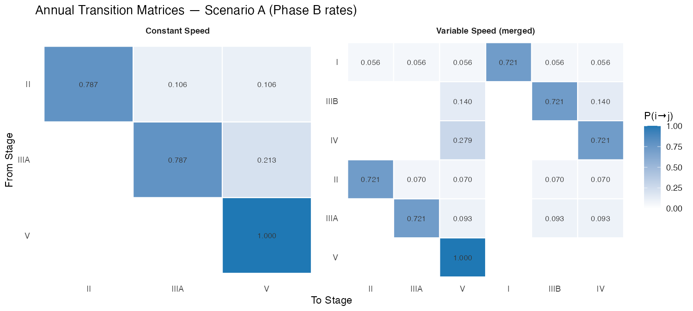
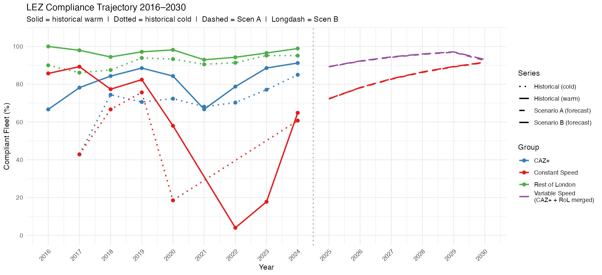
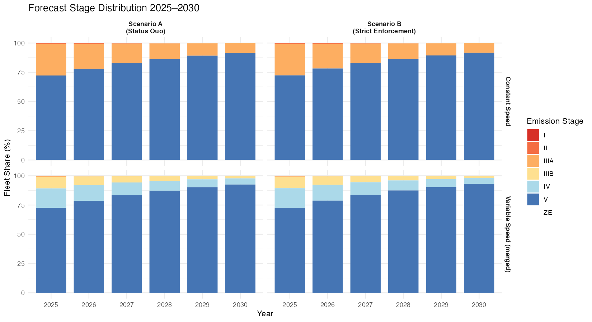
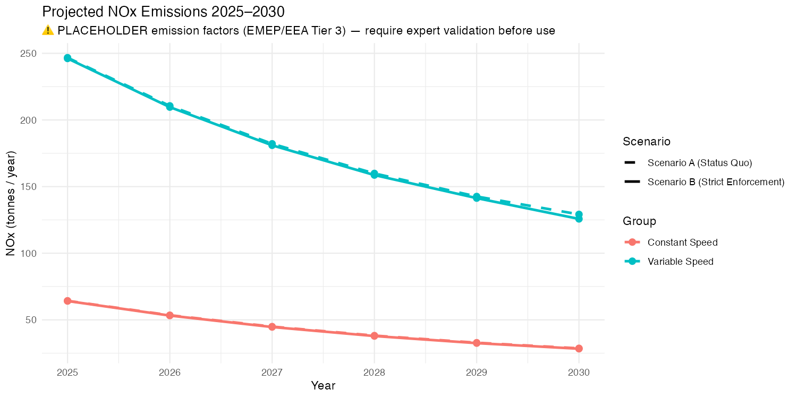

# London NRMM LEZ: Fleet Compliance & Emissions Analysis
**Date:** 31 March 2026 | **Data period:** 2016–2024 | **Research Plan:** v1.17

---

## 1. Executive Summary

The London Non-Road Mobile Machinery (NRMM) Low Emission Zone (LEZ), active since September 2015, has produced measurable compliance improvement across all equipment groups. Analysis of 10,749 audit records identifies three distinct compliance drivers — natural fleet turnover, proactive voluntary LEZ response, and direct enforcement — with materially different magnitudes by group and phase. Under current Phase B transition rates, the audited fleet is forecast to reach 72–92% Stage-compliance by 2025, rising to 92–93% by 2030.

**Key findings:**

- 36.8% of all audited machines were non-compliant at initial audit; cold-engaged machines are 72.3% non-compliant vs 29.6% of warm-engaged machines — confirming that cold sites represent ignorant or surveillance-avoiding operators, not a clean market counterfactual
- The voluntary proactive LEZ response (λ_Proactive) is detectable and substantial across all groups once the enforcement track is separated from the estimation sample
- Enforcement exposure (ē) ranges from 7.8% (Rest of London, Phase A1) to 57.2% (Constant Speed, Phase B) when measured across all records via the `Initial.Machinery.Compliance` field
- NOx emissions from the audited fleet are forecast to fall from ~311 t/yr (2025) to ~158 t/yr (2030), a 49% reduction — driven predominantly by Stage V penetration in Variable Speed equipment

> **⚠ Status note:** Forecast and emissions outputs (Sections 7–8) use v1.16 matrix parameters (all-warm λ_Total). Step 5/6 re-run with v1.17 parameters (compliant-warm λ_Policy, revised ē) is pending.

---

## 2. Dataset Overview

### 2.1 Audit Record Counts

| Fleet | n records | Compliant at initial audit | Non-compliant | Non-compliance rate |
|---|---|---|---|---|
| All records | 10,749 | 6,791 | 3,958 | **36.8%** |
| Warm-engaged | 8,934 | 6,289 | 2,645 | 29.6% |
| Cold-engaged | 1,815 | 502 | 1,313 | **72.3%** |

The sharp divergence between cold (72.3%) and warm (29.6%) non-compliance rates is the primary empirical basis for treating the cold fleet as a population of operators ignorant of or actively avoiding the LEZ, rather than a representative market counterfactual.

### 2.2 Phase B Warm Fleet by Group

| Group | Phase B n (warm) | Policy estimation subset (mc_compliant) |
|---|---|---|
| Constant Speed | 593 | 252 (42.5%) |
| CAZ+ | 2,051 | 1,416 (69.0%) |
| Rest of London | 3,198 | 2,298 (71.9%) |

### 2.3 Compliance Thresholds (Table 1)

| Phase | Period | Constant Speed | CAZ+ | Rest of London |
|---|---|---|---|---|
| A1 | 1.1.2016 – 31.12.2018 | ≥ IIIA (3) | ≥ IIIB (4) | ≥ IIIA (3) |
| A2 | 1.1.2019 – 31.8.2020 | ≥ IIIA (3) | ≥ IIIB (4) | ≥ IIIA (3) |
| B | 1.9.2020 – 31.12.2024 | ≥ V (6) | ≥ IV (5) | ≥ IIIB (4) |
| C | 1.1.2025 – 31.12.2029 | ≥ V (6) | ≥ IV (5)* | ≥ IV (5)* |
| C | 1.1.2030 onwards | ≥ V (6) | ≥ V (6) | ≥ V (6) |

*CAZ+ and Rest of London merge to "Variable Speed" from 1.1.2025. Stage integers: I=1, II=2, IIIA=3, IIIB=4, IV=5, V=6, ZE=7.

---

## 3. Methodology: Compliance Rate Decomposition

### 3.1 Dual-Resolution Architecture

The model uses parallel estimation streams:

- **Stream A (Binary):** collapses stages to Compliant / Non-Compliant per Table 1. Estimates hazard rates answering Objectives 1–3.
- **Stream B (Granular):** tracks full stage distributions. Drives transition matrices, forecasts, and emissions.

### 3.2 Rate Decomposition

The total observed compliance rate is decomposed into three additive components:

$$\lambda_{Policy} = \lambda_{CF} + \lambda_{Proactive}$$

$$\lambda_{Proactive} = \lambda_{Policy} - \lambda_{CF} \quad [\text{floored at } 0]$$

Separately, enforcement exposure is quantified as:

$$\bar{e} = \frac{N_{non\text{-}compliant,\ all\ records}}{N_{total,\ all\ records}} \quad \text{per group} \times \text{phase}$$

| Symbol | Meaning | Estimated from |
|---|---|---|
| $\lambda_{CF}$ | Natural counterfactual turnover rate | Cold-engaged fleet (WLS, Stream B granular) |
| $\lambda_{Policy}$ | Total voluntary compliance rate | Warm-engaged, **compliant subset only** (`mc_compliant == TRUE`) |
| $\lambda_{Proactive}$ | Rate attributable to anticipatory LEZ response | $\lambda_{Policy} - \lambda_{CF}$ |
| $\bar{e}$ | Annual enforcement exposure proportion | All records (cold + warm), MC field |

### 3.3 WLS Estimator

For each estimation window, let $p_{c,t}$ be the proportion compliant and $n_t$ the fleet count at time $t$. The WLS regression model is:

$$\frac{\Delta p_{c,t}}{\Delta t} = \lambda \cdot (1 - p_{c,t}) + \varepsilon_t$$

This constrains the compliance growth rate to be proportional to the remaining non-compliant mass — a standard first-order replacement hazard model. Observations are weighted by $n_t$. Standard errors are derived from the WLS covariance matrix.

### 3.4 Estimation Windows

| Case | Window | Method |
|---|---|---|
| CS λ_CF | Cold fleet, 2017–2023 (2024 excluded) | Annual proportions, WLS |
| VS A1/A2 λ_CF | Cold fleet, Phase A1 + A2 pooled | Annual proportions, WLS |
| VS Phase B λ_CF | Cold fleet, Phase B 3-segment | Segment midpoints: 2021.389, 2022.832, 2024.278 |
| λ_Policy (all groups) | Warm fleet, **mc_compliant only** | Same windows as λ_CF |

---

## 4. Counterfactual Rate (λ_CF) — Cold Fleet

These values represent the natural rate of Stage replacement that would occur without LEZ intervention. All Stream A binary estimates are non-significant (wide CIs from small cold samples). **Stream B granular estimates are authoritative** for downstream calculations.

### 4.1 Stream A Binary λ_CF

| Case | λ_CF | SE | 95% CI | Sig? |
|---|---|---|---|---|
| A1/A2 Variable Speed (pooled) | 0.130 | 0.198 | [−0.257, 0.517] | No |
| Constant Speed Phase A (IIIA threshold) | −0.107 | 0.417 | [−0.925, 0.710] | No |
| Constant Speed Phase B (V threshold) | **0.000** | — | — | By inspection |
| CAZ+ Phase B (IV threshold, 3-seg) | 0.161 | 0.143 | [−0.119, 0.442] | No |
| Rest of London Phase B (IIIB threshold, 3-seg) | 0.152 | 0.157 | [−0.156, 0.460] | No |

> **CS Phase A binary λ_CF = −0.107** is a noise artefact: n=9 cold CS records in 2020 with p_c = 0.556, a sharp drop from 0.757 in 2019. Treat as unreliable; use Stream B granular value.
> **CS Phase B λ_CF = 0** is correct: no Stage V machinery appeared in the cold CS fleet 2021–2023.

### 4.2 Stream B Granular λ_CF (Authoritative)

| Group | λ_CF | SE | 95% CI |
|---|---|---|---|
| Constant Speed | **0.358** | 0.067 | [0.226, 0.490] |
| CAZ+ | **0.363** | 0.052 | [0.261, 0.464] |
| Rest of London | **0.219** | 0.048 | [0.125, 0.313] |

Estimated by pooling cold records 2017–2023 (CS) and Phase B 3-segment (CAZ+/RoL) using the full stage transition distribution.

### 4.3 Cold Fleet Stage Distribution Over Time

### 4.4 Bias Direction

The cold fleet **overestimates** the true market counterfactual rate. Cold sites acquire second-hand equipment whose Stage composition has already been elevated by LEZ-driven demand in the second-hand market. Consequently, $\lambda_{CF}$ is a conservative (upper) bound on the true natural replacement rate, and $\lambda_{Proactive}$ is a conservative lower bound on the true proactive LEZ response.

---

## 5. Enforcement Exposure (ē) — v1.17

ē is measured as the proportion of all audit records (cold-engaged and warm-engaged combined) where `Initial.Machinery.Compliance == "non-compliant"`, per group × phase. This captures the full scope of LEZ enforcement obligation at the point of audit.

$$\bar{e}_{g,\phi} = \frac{\#\{records : Initial.MC = \text{"non-compliant"}\}_{g,\phi}}{N_{g,\phi}^{all}}$$

### 5.1 Enforcement Rate Table

| Group | Phase | n_all | n_cold | n_warm | n_nc | ē |
|---|---|---|---|---|---|---|
| Constant Speed | A1 | 104 | 16 | 88 | 30 | 0.288 |
| Constant Speed | A2 | 316 | 46 | 270 | 172 | **0.544** |
| Constant Speed | B | 692 | 99 | 593 | 396 | **0.572** |
| CAZ+ | A1 | 400 | 51 | 349 | 101 | 0.253 |
| CAZ+ | A2 | 658 | 69 | 589 | 225 | 0.342 |
| CAZ+ | B | 2,292 | 241 | 2,051 | 817 | 0.356 |
| Rest of London | A1 | 538 | 88 | 450 | 42 | **0.078** |
| Rest of London | A2 | 1,634 | 288 | 1,346 | 587 | 0.359 |
| Rest of London | B | 4,115 | 917 | 3,198 | 1,588 | 0.386 |

> **CS Phase A2/B ē ≈ 0.54–0.57**: Enforcement obligation is high but no longer approaches unity (cf. v1.16 ē = 0.825 for warm-only CS Phase B). The change reflects inclusion of cold-engaged records, which dilute the warm-only Stage V non-compliance signal for CS.

> **RoL Phase A1 ē = 0.078**: Genuinely low — the IIIA threshold in Phase A was already well-met by the RoL fleet; most machines were compliant from the outset.

> **Phase A2 step-up across all groups**: The jump in ē from A1 to A2 (e.g. RoL: 0.078 → 0.359) reflects both an expanding audit programme and increasing fleet age, not a change in thresholds (IIIA/IIIB thresholds held constant).

---

## 6. Policy Rate (λ_Policy) and Proactive Attribution

λ_Policy is estimated from **warm-engaged records where `Initial.Machinery.Compliance == "compliant"` only** (70.4% of the warm fleet, n = 6,289). This isolates the trajectory of operators who maintained compliance at each audit — the pure voluntary policy response pathway, uncontaminated by enforcement-driven upgrades.

### 6.1 λ_Policy Estimates (Compliant-Warm Subset)

| Case | n (comp-warm) | λ_Policy | SE | 95% CI | Sig? |
|---|---|---|---|---|---|
| A1/A2 Variable Speed pooled | 2,094 | **0.361** | 0.162 | [0.043, 0.679] | Yes |
| CS Phase A | 194 | 1.000† | 0.434 | [0.150, 1.850] | Marginal |
| CS Phase B | 252 | **0.264** | 0.182 | [−0.093, 0.620] | No |
| CAZ+ Phase B | 1,416 | **0.536** | 0.024 | [0.490, 0.582] | **Yes — high precision** |
| RoL Phase B | 2,298 | **0.338** | 0.177 | [−0.010, 0.685] | Marginal |

> **†CS Phase A λ_Policy = 1.000 (ceiling artefact):** The compliant-warm CS Phase A subset showed near-perfect compliance every year (p_c = 1.00, 1.00, 0.978, 1.00). The WLS estimate reaches the boundary; λ_Proactive = 1.107 exceeds 1.0 and is not interpretable. Treat CS Phase A as data-sparse — do not use in downstream calculations.

> **CAZ+ Phase B λ_Policy = 0.536 (CI ±0.046)** is the most precisely estimated rate in the dataset. Compliance in the compliant-warm CAZ+ subset rose from 84% → 96.5% → 98.7% across Phase B segments — a 14.7 percentage point gain driven entirely by voluntary proactive upgrading.

### 6.2 Compliance Trajectories

**Warm fleet (all):**

**Compliant-warm subset (λ_Policy estimation basis):**

**Cold fleet:**

---

## 7. Compliance Rate Decomposition

The full decomposition compares λ_CF, λ_Policy, ē, and the derived λ_Proactive side-by-side. The v1.17 decomposition no longer subtracts ē from λ_Policy (the compliant subset already excludes enforcement-driven records by construction).

### 7.1 Full Decomposition Table (v1.17)

| Case | λ_CF | ē | λ_Policy | λ_Proactive | λ_Proactive / λ_Policy |
|---|---|---|---|---|---|
| A1/A2 Var Speed (pooled) | 0.130 | 0.296 | 0.361 | **0.231** | 64% |
| CS Phase A | −0.107† | 0.481 | 1.000† | 1.107† | — (artefact) |
| CS Phase B | 0.000 | 0.572 | 0.264 | **0.264** | 100% |
| CAZ+ Phase B | 0.161 | 0.356 | 0.536 | **0.375** | 70% |
| RoL Phase B | 0.152 | 0.386 | 0.338 | **0.186** | 55% |

†CS Phase A values are unreliable due to near-perfect compliance floor in the estimation subset and n=9 noise in cold fleet (see §4.1, §6.1).

### 7.2 Comparison: v1.16 vs v1.17 Estimates

The table below illustrates the change in parameter estimates between the original all-warm analysis (v1.16) and the revised compliant-warm analysis (v1.17).

| Case | λ_Total v1.16 | λ_Policy v1.17 | Δ | ē v1.16 | ē v1.17 | Δ |
|---|---|---|---|---|---|---|
| A1/A2 Var Speed | 0.292 | 0.361 | +0.069 | 0.058 (warm only) | 0.296 (all) | +0.238 |
| CS Phase B | 0.213 | 0.264 | +0.051 | 0.825 (warm only) | 0.572 (all) | −0.253 |
| CAZ+ Phase B | 0.311 | 0.536 | +0.225 | 0.192 (warm only) | 0.356 (all) | +0.164 |
| RoL Phase B | 0.265 | 0.338 | +0.073 | 0.039 (warm only) | 0.386 (all) | +0.347 |

**Interpretation of shifts:**

- **λ_Policy > λ_Total** consistently: filtering to the compliant-warm subset removes the drag of non-compliant machines sitting in non-compliant states, revealing a stronger voluntary improvement trajectory than the aggregate warm fleet showed.
- **ē rises for most groups** because cold non-compliant records (72.3% non-compliance rate) are added to the denominator alongside warm non-compliant records. The exception is CS Phase B, where adding cold records (which lack Stage V) dilutes the near-universal warm non-compliance under the Stage V mandate.
- **CS Phase B λ_Proactive = 0.264 (v1.17) vs 0 [floored] (v1.16):** Isolating the compliant-warm CS Phase B subset reveals a real proactive response — operators with compliant machines were improving at 26.4%/yr. Under v1.16, this signal was buried in the all-warm average depressed by the mass of non-compliant Stage IIIA machines.

---

## 8. Transition Matrices (Phase B) — Current Forecast Basis

The following right-stochastic matrices were used for the Phase C forecast (built from v1.16 λ_Total parameters). Each row sums to 1. Off-diagonal elements above the diagonal represent upgrade probabilities; the diagonal is the stay-in-stage probability.

$$\mathbf{P}_{ij} = \begin{cases} 1 - \lambda & i = j \\ \lambda / (n - i) & j > i \\ 0 & j < i \end{cases}$$

where $n$ is the number of active stages for that group and $\lambda$ is the Phase B total rate.

### 8.1 Scenario A Matrices (Status Quo)

**Constant Speed (λ = 0.2126, stages: II, IIIA, V)**

|  | → II | → IIIA | → V |
|---|---|---|---|
| **II** | 0.7874 | 0.1063 | 0.1063 |
| **IIIA** | 0 | 0.7874 | 0.2126 |
| **V** | 0 | 0 | 1.000 |

**CAZ+ (λ = 0.3109, stages: I–V)**

|  | → I | → II | → IIIA | → IIIB | → IV | → V |
|---|---|---|---|---|---|---|
| **I** | 0.6891 | 0.0622 | 0.0622 | 0.0622 | 0.0622 | 0.0622 |
| **II** | 0 | 0.6891 | 0.0777 | 0.0777 | 0.0777 | 0.0777 |
| **IIIA** | 0 | 0 | 0.6891 | 0.1036 | 0.1036 | 0.1036 |
| **IIIB** | 0 | 0 | 0 | 0.6891 | 0.1554 | 0.1554 |
| **IV** | 0 | 0 | 0 | 0 | 0.6891 | 0.3109 |
| **V** | 0 | 0 | 0 | 0 | 0 | 1.000 |

**Variable Speed merged (λ = 0.2794, from 1.1.2025)**

|  | → I | → II | → IIIA | → IIIB | → IV | → V |
|---|---|---|---|---|---|---|
| **I** | 0.7206 | 0.0559 | 0.0559 | 0.0559 | 0.0559 | 0.0559 |
| **II** | 0 | 0.7206 | 0.0699 | 0.0699 | 0.0699 | 0.0699 |
| **IIIA** | 0 | 0 | 0.7206 | 0.0931 | 0.0931 | 0.0931 |
| **IIIB** | 0 | 0 | 0 | 0.7206 | 0.1397 | 0.1397 |
| **IV** | 0 | 0 | 0 | 0 | 0.7206 | 0.2794 |
| **V** | 0 | 0 | 0 | 0 | 0 | 1.000 |

### 8.2 Scenario B — Enforcement Mask

Scenario B zeros transitions into non-compliant stages, redistributing excised probability mass equally across compliant targets. This represents strict enforcement: machines can only replace into compliant stages.

---

## 9. Starting Fleet Counts (End of 2024)

| Group | I | II | IIIA | IIIB | IV | V | Total |
|---|---|---|---|---|---|---|---|
| Constant Speed | — | 1 | 38 | — | — | 72 | **111** |
| CAZ+ | 0 | 0 | 4 | 29 | 91 | 252 | **376** |
| Rest of London | 1 | 4 | 4 | 134 | 151 | 519 | **813** |
| **Variable Speed (merged)** | 1 | 4 | 8 | 163 | 242 | 771 | **1,189** |

CS active stages: II, IIIA, V only (CS bypasses IIIB/IV pathway).
2024 compliance: CS ≈ 65% (V threshold); VS ≈ 86% (IV threshold merged).

---

## 10. Forecast Results (2025–2030)

Forecast applies $C^{t+1} = C^t \cdot \mathbf{P}$ iteratively from 2024 end-state. Phase C: CAZ+ and RoL merge to Variable Speed. VS threshold rises from IV to V on 1.1.2030.

### 10.1 Binary Compliance Forecast

| Year | CS % (Scen A) | CS % (Scen B) | VS % (Scen A) | VS % (Scen B) |
|---|---|---|---|---|
| 2025 | 72.2 | 72.3 | 89.2 | 89.3 |
| 2026 | 78.1 | 78.2 | 92.1 | 92.3 |
| 2027 | 82.7 | 82.8 | 94.3 | 94.5 |
| 2028 | 86.3 | 86.5 | 95.8 | 96.0 |
| 2029 | 89.2 | 89.4 | 96.9 | 97.1 |
| **2030** | **91.5** | **91.6** | **92.5** | **93.1** |

> VS compliance drops from 97% (2029) to 93% (2030) due to the threshold step-up from IV to V on 1.1.2030 — previously-compliant Stage IV machines become non-compliant.

> **Scenario A vs B difference is negligible (<0.6%)** because the current Scenario B design only redirects probability mass (no additional enforcement transition rate). This will change once Step 5/6 is re-run with v1.17 ē incorporated as an additive transition component for non-compliant stages.

### 10.2 Granular Stage Proportion Forecast

**Constant Speed 2030 stage distribution:** Stage V = 91.5%, IIIA = 8.3%, II = 0.2%

**Variable Speed 2030 stage distribution:** Stage V = 93.1%, IV = 5.3%, IIIB = 1.9%, lower stages < 0.2%

---

## 11. NOx Emissions Forecast

Annual NOx emissions estimated as:

$$E_{g,t} = \sum_{s} N_{g,s,t} \times \overline{kW}_{g,s} \times 2000\ \text{hrs/yr} \times EF_s$$

where $N_{g,s,t}$ is machine count by group/stage/year, $\overline{kW}_{g,s}$ is the fleet-average engine power, and $EF_s$ is the stage emission factor.

### 11.1 Mean Engine Power by Group × Stage (warm fleet)

| Group | Stage | kW mean | n |
|---|---|---|---|
| Constant Speed | II | 117 | 42 |
| Constant Speed | IIIA | 179 | 656 |
| Constant Speed | V | 144 | 95 |
| CAZ+ | IIIA | 120 | 127 |
| CAZ+ | IIIB | 84 | 881 |
| CAZ+ | IV | 141 | 789 |
| CAZ+ | V | 93 | 1,052 |
| Rest of London | IIIA | 109 | 312 |
| Rest of London | IIIB | 77 | 2,026 |
| Rest of London | IV | 132 | 1,217 |
| Rest of London | V | 87 | 1,264 |

CS IIIB (n=1, 440 kW) and CS IV (n=1, 168 kW) are single-record outliers; group mean (172 kW) substituted for emissions calculations.

### 11.2 Emission Factors ⚠ PLACEHOLDER

| Stage | I | II | IIIA | IIIB | IV | V | ZE |
|---|---|---|---|---|---|---|---|
| NOx (g/kWh) | 10.0 | 7.0 | 5.0 | 3.5 | 2.0 | 0.4 | 0.0 |

**Source:** EMEP/EEA Tier 3 (Ntziachristos & Samaras, 2019). These are standard factors and require replacement with project-specific power-band weighted averages before final reporting.

### 11.3 Annual NOx Forecast

| Year | CS (Scen A) t/yr | CS (Scen B) t/yr | VS (Scen A) t/yr | VS (Scen B) t/yr | Total A | Total B |
|---|---|---|---|---|---|---|
| 2025 | 64.3 | 64.1 | 247 | 246 | 311 | 310 |
| 2026 | 53.5 | 53.2 | 211 | 210 | 265 | 263 |
| 2027 | 44.9 | 44.6 | 182 | 181 | 227 | 226 |
| 2028 | 38.2 | 37.8 | 160 | 159 | 198 | 197 |
| 2029 | 32.8 | 32.5 | 143 | 141 | 176 | 174 |
| **2030** | **28.6** | **28.3** | **129** | **126** | **158** | **154** |

**2025→2030 reduction: −49% (Scenario A), −50% (Scenario B)**

The VS fleet dominates total NOx at all timepoints (>75% of total), despite higher Stage V penetration, due to 10.7× larger fleet size (1,189 vs 111 machines) and lower mean kW per machine.

---

## 12. Caveats and Pending Work

### 12.1 Active Caveats

| # | Caveat | Impact |
|---|---|---|
| 1 | **Forecast uses v1.16 matrices** (all-warm λ_Total). Step 5/6 re-run with v1.17 λ_Policy required. | Compliance and emissions forecasts may change materially, particularly Scenario B. |
| 2 | **Scenario B currently negligible** (<0.6% compliance difference from A). Not yet reflects v1.17 enforcement-additive design (λ_Policy + ē for non-compliant stages). | Scenario B will show substantially faster compliance under v1.17. |
| 3 | **Emission factors are EMEP/EEA Tier 3 placeholders**. Power-band weighting not yet applied. | Absolute emission totals are approximate; reduction ratios are more robust. |
| 4 | **CS Phase A parameters unreliable** (ceiling artefact in λ_Policy; n=9 noise in cold λ_CF). | CS Phase A proactive rate not estimable; Phase B estimates are authoritative. |
| 5 | **λ_CF overestimates natural rate** (second-hand market leakage). | λ_Proactive is a conservative lower bound on the true proactive LEZ effect. |
| 6 | **Fleet entry/exit not modelled**. N is fixed at 2024 observed. | Absolute emission totals are a lower bound if the audited fleet grows. |

### 12.2 Pending

- Re-run `260330_step5_6_matrix_forecast.R` with `260331_step4_revised_parameters.RData` as input, incorporating enforcement-additive Scenario B (λ_Policy + ē for non-compliant stages)
- Replace placeholder emission factors with validated power-band averages
- Generate updated `260331_step5_6_output.md` findings document

---

*Scripts: `260329_step1_ingestion.R`, `260329_step2_exploratory.R`, `260329_step3b_lambda_temporal.R`, `260329_step3c_cs_lambda.R`, `260330_step4_parameter_estimation.R`, `260331_step4_revised.R`, `260330_step5_6_matrix_forecast.R`*

*RData objects: `260329_step1_ingestion.RData`, `260329_step2_exploratory.RData`, `260330_step4_parameters.RData`, `260331_step4_revised_parameters.RData`, `260330_step5_6_results.RData`*
