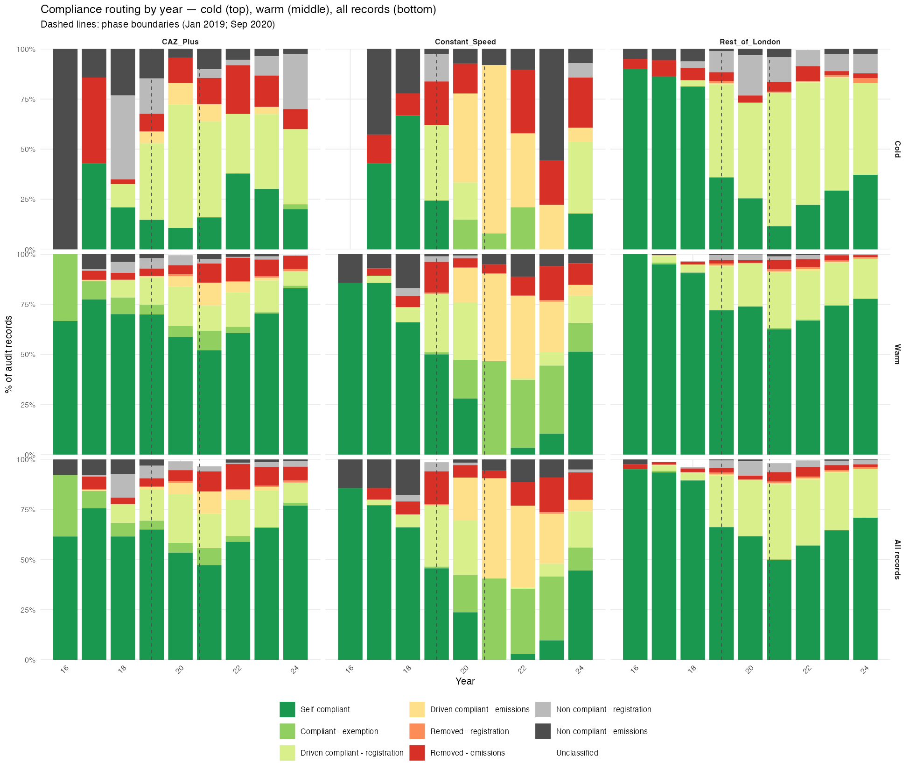
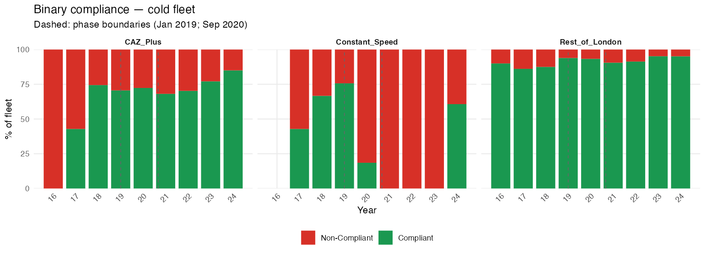

# London NRMM LEZ
## Compliance Effect Analysis

**Data period:** 2016–2024
**n = 10,749 audit records across three equipment groups**

Research Plan v1.18 | 31 March 2026

---

## Executive Summary

Three-component decomposition of stage-based compliance improvement into natural market turnover, voluntary proactive LEZ response, and direct enforcement.

### Principal findings

- **59.7%** of all audit records are self-compliant at initial audit — no enforcement needed
- **22.2%** are driven compliant via *registration* only — no stage change results
- Only **8.7%** involve a machine below the stage threshold that is removed or driven compliant — the records that produce actual emissions change
- Stage non-compliance rate: **13.8%** of warm fleet vs 29.6% from `Initial.Machinery.Compliance` — gap is entirely registration-only failures
- **Rest of London Phase B** stage ē = 4.0% — the RoL fleet was already largely above IIIB threshold; its 28.1% `Initial.Machinery.Compliance` rate reflects unregistered machines, not emissions failures
- Voluntary proactive LEZ response (λ_Proactive) is detectable in all groups when estimation is restricted to self-compliant warm records

---

## Data and Fleet Structure

### Equipment groups

| Group | Description | Phase B threshold |
|---|---|---|
| **Constant Speed (CS)** | Generators and constant-speed plant | Stage V (≥6) |
| **CAZ+** | Variable-speed, Central Activity Zone + Olympic Area | Stage IV (≥5) |
| **Rest of London (RoL)** | Variable-speed, Greater London outside CAZ+ | Stage IIIB (≥4) |

Stage mapping: I=1, II=2, IIIA=3, IIIB=4, IV=5, V=6, ZE=7

### Model phases

| Phase | Period | Key change |
|---|---|---|
| A1 | 1 Jan 2016 – 31 Dec 2018 | Initial programme |
| A2 | 1 Jan 2019 – 31 Aug 2020 | Stage V equipment newly available |
| **B** | **1 Sep 2020 – 31 Dec 2024** | **Threshold step-up: CS→V, CAZ+→IV, RoL→IIIB** |

Phase B subdivided into three equal segments (~527 days) for variable-speed estimation.

---

## Compliance Routing — Classification Rules

Every audit record assigned to one of eight outcomes using three fields:
`Initial.Stage` vs threshold · `Initial.Machinery.Compliance` · `Final.Machinery.Compliance`

| Routing | Stage OK? | `Initial.Machinery.Compliance` | Final outcome | **Stage change?** |
|---|---|---|---|---|
| Self-compliant | ✓ | compliant | — | No |
| Compliant — exemption/viability | ✗ | compliant | — | No |
| Driven compliant — registration | ✓ | non-compliant | compliant | No |
| Removed — registration | ✓ | non-compliant | removed | No |
| Non-compliant — registration | ✓ | non-compliant | unresolved | No |
| **Driven compliant — emissions** | **✗** | **non-compliant** | **compliant** | **Yes** |
| **Removed — emissions** | **✗** | **non-compliant** | **removed** | **Yes** |
| Non-compliant — emissions | ✗ | non-compliant | unresolved | No |

Only the two **bold** rows produce a stage transition through enforcement.

---

## Compliance Routing — Overall Counts (n = 10,749)

| Routing | n | % |
|---|---|---|
| Self-compliant | 6,417 | 59.7% |
| Driven compliant — registration | 2,388 | 22.2% |
| **Removed — emissions** | **557** | **5.2%** |
| **Driven compliant — emissions** | **380** | **3.5%** |
| Compliant — exemption/viability | 374 | 3.5% |
| Non-compliant — registration | 356 | 3.3% |
| Non-compliant — emissions | 216 | 2.0% |
| Removed — registration | 61 | 0.6% |

Registration-driven routes together: **26.1%** of all records — none produce a stage change.

Emissions-driven enforcement (stage change): **8.7%** (937 records).

---

## Compliance Routing — Year-by-Year

Cold fleet (top) · Warm fleet (middle) · All records (bottom)

---

## Compliance Routing — Key Patterns

- **Phase B boundary (Sep 2020):** step-up in emissions-driven routes visible across all groups
- **Constant Speed Phase B:** 215 records hold viability exemptions; 231 driven compliant via emissions; only 81 self-compliant — almost entirely enforcement or exemption territory
- **Rest of London Phase B:** non-self-compliant mass is almost entirely "driven compliant — registration" — fleet was emissions-compliant, significant unregistered machines
- **CAZ+:** sustained "driven compliant — registration" from 2019 onwards; persistent "removed — emissions" throughout Phase B

### Routing by group × phase (selected)

| Group | Phase | Self-compliant | Driven compliant — reg | Driven compliant — emis | Removed — emis | Compliant — exemption |
|---|---|---|---|---|---|---|
| CAZ+ | B | 1,393 | 385 | 109 | 226 | 82 |
| CS | B | 81 | 35 | 231 | 77 | 215 |
| RoL | B | 2,514 | 1,234+ | — | — | — |

---

## Decomposition Framework

$$\lambda_{\text{Policy}} = \lambda_{\text{CF}} + \lambda_{\text{Proactive}}$$

### Three components

| Component | Symbol | Estimated from |
|---|---|---|
| Counterfactual rate | λ_CF | Cold-engaged fleet stage distribution |
| Policy rate | λ_Policy | Warm fleet, **self-compliant records only** |
| Proactive rate | λ_Proactive | Derived: λ_Policy − λ_CF (floored at 0) |

### Enforcement exposure

$$\bar{e}_{g,\phi} = \frac{\#\{records : \text{Initial.Stage} < \text{threshold}_{g,\phi}\}}{N_{g,\phi}^{all}}$$

Counts records where stage is below threshold across **all records** (cold + warm). Registration-only non-compliance excluded by construction.

### WLS estimator

$$\frac{\Delta p_{c,t}}{\Delta t} = \lambda \cdot (1 - p_{c,t})$$

Weighted by $n_t$, no intercept. 95% CI = ±1.96 SE.

---

## Counterfactual Rate (λ_CF)

λ_CF = annual rate of stage improvement without LEZ intervention.

Estimated from the cold-engaged fleet (sites not registered with the LEZ).

### Stream B granular estimates (authoritative)

| Group | λ_CF | SE | 95% CI |
|---|---|---|---|
| **Constant Speed** | **0.358** | 0.067 | [0.226, 0.490] |
| **CAZ+** | **0.363** | 0.052 | [0.261, 0.464] |
| **Rest of London** | **0.219** | 0.048 | [0.125, 0.313] |

### Bias direction

The cold fleet **overestimates** the true counterfactual rate — LEZ demand elevates second-hand stock entering unregistered sites. λ_CF is a conservative upper bound; λ_Proactive is a conservative lower bound.

CS Phase B: λ_CF = 0 confirmed by inspection — no Stage V machinery in cold CS fleet 2021–2023.

---

## Cold Fleet — Compliance Profiles

---

## Enforcement Exposure (ē)

| Group | Phase | N (all records) | N (Stage < threshold) | **ē** |
|---|---|---|---|---|
| CS | A1 | 104 | 23 | 0.221 |
| CS | A2 | 316 | 56 | 0.177 |
| **CS** | **B** | **692** | **492** | **0.711** |
| CAZ+ | A1 | 400 | 48 | 0.120 |
| CAZ+ | A2 | 658 | 50 | 0.076 |
| CAZ+ | B | 2,292 | 457 | 0.199 |
| RoL | A1 | 538 | 26 | 0.048 |
| RoL | A2 | 1,634 | 52 | 0.032 |
| **RoL** | **B** | **4,115** | **162** | **0.039** |

CS Phase B ē = **0.711** — the Stage V mandate left 71% of CS machines non-compliant on emissions.
RoL Phase B ē = **0.039** — RoL fleet was already largely above IIIB threshold.

---

## Enforcement Exposure — Stage vs `Initial.Machinery.Compliance`

Positive gap = `Initial.Machinery.Compliance` overcounts by including registration failures (no stage change).

| Group | Phase | Stage ē (warm) | `IMC` ē (warm) | Gap |
|---|---|---|---|---|
| CAZ+ | A2 | 0.095 | 0.282 | +0.187 |
| CAZ+ | B | 0.192 | 0.310 | +0.118 |
| CS | B | **0.828** | 0.526 | −0.302 |
| RoL | A2 | 0.025 | 0.285 | +0.260 |
| **RoL** | **B** | **0.040** | **0.281** | **+0.241** |

**RoL Phase B:** 24 percentage point gap = registration-only non-compliance with no emissions consequence.

**CS Phase B negative gap:** many CS machines hold viability exemptions — `Initial.Machinery.Compliance` = compliant despite Stage < V threshold.

---

## Policy Rate (λ_Policy) — Self-Compliant Warm Subset

Estimated from warm records that are **self-compliant at initial audit** — machines meeting stage threshold, registered. Captures voluntary proactive LEZ response free from enforcement contamination.

### λ_Policy estimates

| Case | n | λ_Policy | SE | 95% CI | Significant? |
|---|---|---|---|---|---|
| A1/A2 Variable Speed pooled | 2,094 | **0.361** | 0.162 | [0.043, 0.679] | Yes |
| CS Phase B | 252 | **0.264** | 0.182 | [−0.093, 0.620] | Marginal |
| **CAZ+ Phase B** | **1,416** | **0.536** | **0.024** | **[0.490, 0.582]** | **Yes — high precision** |
| RoL Phase B | 2,298 | **0.338** | 0.177 | [−0.010, 0.685] | Marginal |

---

## Full Decomposition

$$\lambda_{\text{Proactive}} = \lambda_{\text{Policy}} - \lambda_{\text{CF}} \quad \text{(floored at 0)}$$

| Case | λ_CF | λ_Policy | **λ_Proactive** | ē | λ_Pro / λ_Policy | Reliability |
|---|---|---|---|---|---|---|
| A1/A2 Var Speed | 0.130 | 0.361 | **0.231** | 0.076 | 64% | Good |
| CS Phase B | 0.000 | 0.264 | **0.264** | 0.711 | 100% | Moderate |
| **CAZ+ Phase B** | **0.161** | **0.536** | **0.375** | **0.199** | **70%** | **Excellent** |
| RoL Phase B | 0.152 | 0.338 | **0.186** | 0.039 | 55% | Moderate |

CS Phase B: λ_CF = 0 → every unit of voluntary compliance is entirely attributable to the proactive LEZ response.

CAZ+ Phase B: most precisely estimated case; 84% → 98.7% compliance in self-compliant warm subset over Phase B; proactive response (0.375/yr) is the largest of any group.

RoL Phase B: genuine but modest proactive response (0.186/yr) against very low stage-threshold enforcement exposure — policy effect here is predominantly through registration compliance, not stage upgrading.

---

## Key Results Summary

| Finding | Value |
|---|---|
| Self-compliant at initial audit (all records) | **59.7%** (6,417) |
| Driven compliant — registration (no stage change) | **22.2%** (2,388) |
| Driven compliant or removed — emissions (stage change) | **8.7%** (937) |
| Persistent non-compliant | **5.3%** (572) |
| Stage non-compliance rate — warm fleet | **13.8%** |
| λ_CF — Constant Speed | 0.358/yr [0.226, 0.490] |
| λ_CF — CAZ+ | 0.363/yr [0.261, 0.464] |
| λ_CF — Rest of London | 0.219/yr [0.125, 0.313] |
| λ_Policy — CAZ+ Phase B | **0.536/yr** [0.490, 0.582] |
| λ_Proactive — CAZ+ Phase B | **0.375/yr** (70% of λ_Policy) |
| λ_Proactive — CS Phase B | **0.264/yr** (100%; λ_CF = 0) |
| ē — CS Phase B (highest) | **0.711** |
| ē — RoL Phase B (lowest) | **0.039** |

---

## Caveats

| # | Caveat | Impact |
|---|---|---|
| 1 | CS Phase A parameters unreliable — ceiling artefact in λ_Policy, noise artefact in λ_CF (n=9 cold sample) | CS Phase A excluded from conclusions |
| 2 | λ_CF overestimates natural rate — LEZ demand elevates second-hand stock entering cold sites | λ_Proactive is a conservative lower bound |
| 3 | RoL Phase B routing table truncated in console output | Minor; totals confirmed from aggregate counts |
| 4 | `ID` field 51% populated — individual machine tracking is partial | 131 tracked machines with both cold and warm records is an undercount |
| 5 | CS Phase B λ_Policy is marginal (95% CI includes 0) — compliance growth concentrated 2023–2024 | Directionally reliable but uncertain in magnitude |
| 6 | Ecological inference — rates estimated from aggregate annual proportions, not individual machine trajectories | Individual hazard rates may differ from group averages |

---

## Scripts and Data Objects

**Scripts (in execution order):**

`260329_step1_ingestion.R` · `260329_step2_exploratory.R` · `260329_step3_lambda_diagnostics.R` · `260329_step3b_lambda_temporal.R` · `260329_step3c_cs_lambda.R` · `260330_step4_parameter_estimation.R` · `260331_step4_revised.R` · `260330_diagnostic_enforcement.R` · `260331_routing_classification.R`

**Intermediate R objects:**

`260329_step1_ingestion.RData` · `260329_step2_exploratory.RData` · `260331_step4_revised_parameters.RData`

**Output files:**

`260331_routing_stacked.png` · `260331_routing_all.png` · `260331_routing_warm.png` · `260331_routing_cold.png` · `260331_compliance_cold.png` · `260331_compliance_warm_pol.png` · `260331_compliance_warm.png` · `260330_diagnostic_enforcement.txt` · `260331_routing_console.txt`
