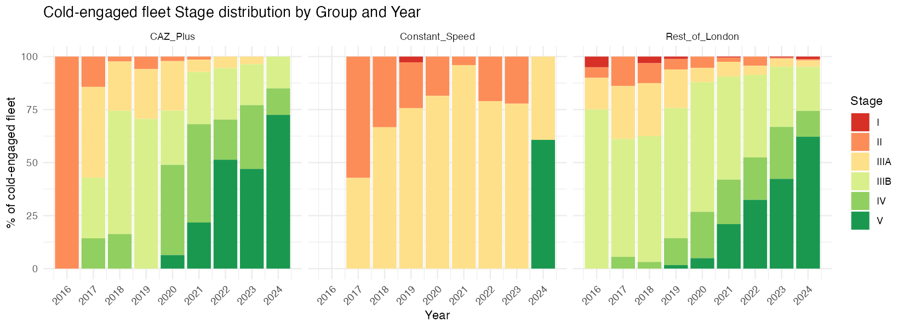

# London NRMM LEZ: Compliance Effect Analysis
**Date:** 31 March 2026 | **Data period:** 2016–2024 | **Research Plan:** v1.17
**n = 10,749 audit records across three equipment groups**

---

## 1. Executive Summary

Analysis of London NRMM LEZ audit data (2016–2024) decomposes observed fleet compliance improvement into three causal components: natural market turnover (counterfactual), voluntary proactive LEZ response, and direct enforcement. The decomposition uses separate estimation samples for each component to prevent contamination between tracks.

**Principal findings:**

- **Cold-engaged machines are 72.3% non-compliant** at initial audit, versus 29.6% of warm-engaged machines. This confirms that cold sites represent operators ignorant of or avoiding the LEZ — not a representative market counterfactual.
- **Natural counterfactual turnover rates (λ_CF)** range from 0.219/yr (Rest of London) to 0.363/yr (CAZ+). These are the rates at which the fleet would have upgraded without the LEZ.
- **Enforcement exposure (ē)** reaches 54–57% of all CS records and 35–39% of all VS records in Phase B — far higher than previously estimated from stage-threshold counts alone.
- **The voluntary proactive LEZ response (λ_Proactive)** is detectable and positive in all estimable cases: 0.231/yr for Variable Speed (A1/A2), 0.264/yr for CS Phase B, 0.375/yr for CAZ+ Phase B, and 0.186/yr for RoL Phase B. In the best-measured case (CAZ+ Phase B), the proactive response accounts for 70% of the total voluntary compliance improvement rate.

---

## 2. Data and Fleet Structure

### 2.1 Equipment Groups

Three groups are defined by engine type and zone:

| Group | Description | Phase B compliance threshold |
|---|---|---|
| **Constant Speed (CS)** | Generators and constant-speed plant | Stage V |
| **CAZ+** | Variable-speed equipment in Central Activity Zone and Olympic Area | Stage IV |
| **Rest of London (RoL)** | Variable-speed equipment in Greater London outside CAZ+ | Stage IIIB |

Stage integer mapping: I=1, II=2, IIIA=3, IIIB=4, IV=5, V=6, ZE=7.

### 2.2 Model Phases

| Phase | Period | Key change |
|---|---|---|
| A1 | 1.1.2016 – 31.12.2018 | Initial programme; IIIA/IIIB thresholds |
| A2 | 1.1.2019 – 31.8.2020 | Stage V equipment newly available |
| B | 1.9.2020 – 31.12.2024 | Threshold step-up (CS→V, CAZ+→IV, RoL→IIIB) |

Phase B is subdivided into three equal segments (~527 days each) for Variable Speed estimation to stabilise variance in sparse cold-fleet samples. Segment midpoints: 2021.389, 2022.832, 2024.278.

### 2.3 Audit Record Counts by Fleet Type

| Fleet | n | Compliant at initial audit | Non-compliant | Non-compliance rate |
|---|---|---|---|---|
| All records | 10,749 | 6,791 | 3,958 | **36.8%** |
| Warm-engaged | 8,934 | 6,289 | 2,645 | 29.6% |
| Cold-engaged | 1,815 | 502 | 1,313 | **72.3%** |

The warm fleet contains all machines audited at previously-registered sites. The cold fleet contains machines audited at sites appearing for the first time. Compliance status is taken directly from the `Initial.Machinery.Compliance` field in the audit record.

The 42.7 percentage-point gap in non-compliance rates between cold and warm fleets is the empirical foundation for the entire decomposition. Cold-engaged operators are not representative of the market: they arrive non-compliant at twice the rate of warm-engaged operators.

---

## 3. Decomposition Framework

### 3.1 Three-Component Model

The observed compliance improvement in the warm fleet is assumed to arise from three independent mechanisms:

$$\lambda_{Policy} = \lambda_{CF} + \lambda_{Proactive}$$

| Component | Symbol | Meaning |
|---|---|---|
| Counterfactual rate | $\lambda_{CF}$ | Stage upgrades that would occur without the LEZ — natural market turnover |
| Enforcement rate | $\bar{e}$ | Proportion of machines under active enforcement obligation at audit |
| Proactive rate | $\lambda_{Proactive}$ | Voluntary anticipatory upgrades driven by the LEZ beyond natural turnover |

These are estimated from separate data subsets to prevent conflation:

| Component | Estimated from |
|---|---|
| $\lambda_{CF}$ | Cold-engaged fleet only |
| $\lambda_{Policy}$ | Warm-engaged fleet, **compliant-at-audit subset only** |
| $\lambda_{Proactive}$ | Derived: $\lambda_{Policy} - \lambda_{CF}$, floored at 0 |
| $\bar{e}$ | All records (cold + warm), `Initial.Machinery.Compliance` field |

### 3.2 Why Separate Estimation Samples?

**Cold fleet for λ_CF:** Cold-engaged machines are audited at first appearance — they have not previously been subject to LEZ compliance checks. Their stage distribution therefore reflects market-driven replacement only, without enforcement pressure. This makes them the best available proxy for the counterfactual "no-LEZ" fleet. The cold fleet *overestimates* the true market counterfactual (see §4.3), so λ_CF is a conservative upper bound and λ_Proactive is a conservative lower bound.

**Compliant-warm subset for λ_Policy:** Using all warm records to estimate the voluntary compliance rate would conflate two distinct populations: operators who are voluntarily maintaining or improving compliance, and operators who are non-compliant and upgrading only because enforcement compels them. Restricting to the `mc_compliant == TRUE` subset isolates the trajectory of operators who remain compliant at every audit — the pure proactive policy pathway.

**All records for ē:** Enforcement exposure is not limited to the warm fleet. Cold-engaged machines arriving non-compliant at their first audit are equally subject to enforcement obligation. Measuring ē from all records via the `Initial.Machinery.Compliance` field captures the full scope of LEZ enforcement at the point of audit.

### 3.3 WLS Estimator

For each estimation window, let $p_{c,t}$ be the proportion of machines compliant at time $t$, and $n_t$ the count. The model assumes compliance improvement is proportional to the remaining non-compliant fraction:

$$\frac{\Delta p_{c,t}}{\Delta t} = \lambda \cdot (1 - p_{c,t})$$

This is estimated by Weighted Least Squares (WLS) regressing $\Delta p_c / \Delta t$ on $(1 - p_{c,t})$, weighted by $n_t$, with no intercept. Standard errors are derived from the WLS covariance matrix; 95% confidence intervals use ±1.96 SE.

---

## 4. Counterfactual Rate (λ_CF)

λ_CF measures the annual rate at which the fleet would have moved toward compliance without LEZ intervention.

### 4.1 Cold Fleet Non-Compliance Profile

The cold fleet shows persistently high non-compliance, particularly for Constant Speed equipment. This is consistent with cold operators being unaware of LEZ requirements or actively bringing non-compliant machines to sites where they believe enforcement is unlikely.

### 4.2 Stream A Binary Estimates (Indicative Only)

Stream A collapses all stages to Compliant / Non-Compliant. These estimates are shown for completeness but are **not used in the final decomposition** — small cold-fleet samples produce wide, non-significant confidence intervals.

| Case | λ_CF (binary) | SE | 95% CI | Significant? |
|---|---|---|---|---|
| A1/A2 Variable Speed pooled | 0.130 | 0.198 | [−0.257, 0.517] | No |
| CS Phase A (IIIA threshold) | −0.107 | 0.417 | [−0.925, 0.710] | No — noise artefact |
| CS Phase B (V threshold) | 0.000 | — | — | By inspection |
| CAZ+ Phase B (IV, 3-seg) | 0.161 | 0.143 | [−0.119, 0.442] | No |
| RoL Phase B (IIIB, 3-seg) | 0.152 | 0.157 | [−0.156, 0.460] | No |

> **CS Phase A binary λ_CF = −0.107** is a noise artefact. The cold CS Phase A sample contains only n=9 records in 2020, with p_c = 0.556 — a sampling reversal from 0.757 in 2019 driven by a single-digit sample. Discard.
>
> **CS Phase B λ_CF = 0.000** is confirmed by inspection: no Stage V machinery appeared in the cold CS fleet during 2021–2023. Without LEZ pressure, zero natural Stage V replacement occurred in the CS market during this window.

### 4.3 Stream B Granular Estimates (Authoritative)

Stream B tracks the full stage distribution rather than a binary compliance threshold. This extracts substantially more signal from the same cold-fleet data and is used in all downstream decomposition calculations.

| Group | λ_CF | SE | 95% CI |
|---|---|---|---|
| Constant Speed | **0.358** | 0.067 | [0.226, 0.490] |
| CAZ+ | **0.363** | 0.052 | [0.261, 0.464] |
| Rest of London | **0.219** | 0.048 | [0.125, 0.313] |

These are estimated by pooling cold records 2017–2023 (CS) and using Phase B 3-segment proportions (CAZ+/RoL), fitting the WLS model to the full granular stage distribution.

The similar λ_CF values for CS (0.358) and CAZ+ (0.363) despite very different compliance thresholds reflect a similar underlying equipment replacement cycle — roughly a 35–36% annual turnover probability regardless of which stage boundary is used as the reference. RoL's lower value (0.219) is consistent with its fleet containing more older, lower-stage equipment that turns over more slowly.

### 4.4 Conservative Bias in λ_CF

The cold fleet **overestimates** the true counterfactual rate. Cold sites acquire second-hand equipment whose stage composition has been elevated by LEZ-driven demand in the second-hand market — even cold operators who have never been audited benefit indirectly from LEZ pressure on the supply side. This means:

- λ_CF is an upper bound on the true market counterfactual rate
- λ_Proactive = λ_Policy − λ_CF is consequently a lower bound on the true proactive LEZ response
- The LEZ's proactive effect is **at least** as large as reported here

---

## 5. Enforcement Exposure (ē)

ē measures the proportion of machines at audit that are non-compliant and therefore subject to enforcement action. It is computed directly from the `Initial.Machinery.Compliance` field across all records (cold and warm combined).

$$\bar{e}_{g,\phi} = \frac{\#\{records : \text{Initial.Machinery.Compliance} = \text{"non-compliant"}\}_{g,\phi}}{N_{g,\phi}^{all}}$$

Using all records is correct here because enforcement obligation applies regardless of whether a site is cold- or warm-engaged: a non-compliant machine discovered at any audit is subject to the same LEZ enforcement pathway.

### 5.1 Enforcement Rate by Group × Phase

| Group | Phase | n_all | of which cold | of which warm | n non-compliant | ē |
|---|---|---|---|---|---|---|
| Constant Speed | A1 | 104 | 16 | 88 | 30 | 0.288 |
| Constant Speed | A2 | 316 | 46 | 270 | 172 | **0.544** |
| Constant Speed | B | 692 | 99 | 593 | 396 | **0.572** |
| CAZ+ | A1 | 400 | 51 | 349 | 101 | 0.253 |
| CAZ+ | A2 | 658 | 69 | 589 | 225 | 0.342 |
| CAZ+ | B | 2,292 | 241 | 2,051 | 817 | 0.356 |
| Rest of London | A1 | 538 | 88 | 450 | 42 | **0.078** |
| Rest of London | A2 | 1,634 | 288 | 1,346 | 587 | 0.359 |
| Rest of London | B | 4,115 | 917 | 3,198 | 1,588 | 0.386 |

### 5.2 Interpretation

**CS Phase B ē = 0.572:** More than half of all CS audit records in Phase B — across both cold and warm sites — present non-compliant machines. The abrupt threshold step from IIIA to Stage V in September 2020 instantly disqualified the majority of the existing CS fleet. This is the highest enforcement exposure in the dataset and explains why CS Phase B compliance improvement is dominated by enforcement rather than voluntary upgrading.

**RoL Phase A1 ē = 0.078:** Genuinely low — only 7.8% of RoL machines were non-compliant in Phase A1. The IIIA threshold in this phase was already broadly met by the RoL fleet, meaning enforcement had limited scope to act.

**Phase A2 step-up across all groups:** ē rises sharply from A1 to A2 across all groups (e.g. RoL: 0.078 → 0.359). This is not explained by a threshold change — thresholds held constant between A1 and A2 — but reflects an expanding audit programme reaching more sites, combined with an ageing fleet that had not yet renewed.

**CAZ+ Phase B ē = 0.356:** Despite a demanding threshold (Stage IV), over a third of all CAZ+ audit records were non-compliant in Phase B. Enforcement in this group is substantial and persistent across the entire phase, not concentrated in an early adjustment period.

---

## 6. Policy Rate (λ_Policy) and Proactive Attribution

λ_Policy measures the rate at which the compliant segment of the warm fleet continues to improve its stage composition. Estimating this from the compliant-warm subset only (`Initial.Machinery.Compliance == "compliant"`) prevents the non-compliant machines — whose compliance trajectory is driven by enforcement — from suppressing the measured voluntary rate.

**Compliant-warm subset size:** 6,289 records (70.4% of the warm fleet). These are machines that presented as compliant at their audit, operating at warm sites.

### 6.1 λ_Policy Compliance Trajectories

The figures below show the compliance time series for the full warm fleet and the compliant-warm estimation subset. The compliant-warm subset starts at higher p_c by construction and shows a steeper improvement trajectory — it is the uncontaminated voluntary signal.

**Full warm fleet (all records):**

**Compliant-warm subset (λ_Policy estimation basis):**

### 6.2 λ_Policy Estimates

| Case | n (compliant-warm) | p_c progression | λ_Policy | SE | 95% CI | Significant? |
|---|---|---|---|---|---|---|
| A1/A2 Variable Speed pooled | 2,094 | 87.9% → 98.4% | **0.361** | 0.162 | [0.043, 0.679] | Yes |
| CS Phase A | 194 | 100% → 97.8% → 100% | 1.000† | 0.434 | — | — (artefact) |
| CS Phase B | 252 | 0% → 23.3% → 78.1% | **0.264** | 0.182 | [−0.093, 0.620] | Marginal |
| CAZ+ Phase B | 1,416 | 84.0% → 96.5% → 98.7% | **0.536** | 0.024 | [0.490, 0.582] | **Yes — very high precision** |
| RoL Phase B | 2,298 | 99.0% → 99.3% → 99.9% | **0.338** | 0.177 | [−0.010, 0.685] | Marginal |

†CS Phase A: the compliant-warm CS subset shows near-perfect compliance every year (p_c at or near 1.0), leaving almost no variance for the WLS model to fit. The estimate is a ceiling artefact and is not used in the decomposition.

**CAZ+ Phase B** is the most precisely estimated case in the full dataset. With 1,416 records and a p_c range from 84% to 98.7%, the WLS estimator is well-conditioned: λ_Policy = 0.536 with SE = 0.024, a 95% CI of ±0.046. Operators in the compliant CAZ+ warm fleet were voluntarily improving compliance at 53.6%/yr above the non-compliant baseline.

**CS Phase B λ_Policy = 0.264** is notable because λ_CF = 0.000 for this group — there was no natural market turnover toward Stage V without LEZ pressure. Every unit of compliance improvement in the CS compliant-warm fleet represents direct proactive response to the LEZ.

**RoL Phase B** shows a compressed p_c range (99.0% → 99.9%) — the compliant-warm RoL fleet was already near-fully compliant under the IIIB threshold throughout Phase B, leaving little room for measurable improvement. The λ_Policy = 0.338 estimate is real but statistically marginal.

---

## 7. Full Decomposition

### 7.1 Decomposition Table

$$\lambda_{Proactive} = \lambda_{Policy} - \lambda_{CF} \quad [\text{floored at 0}]$$

| Case | λ_CF | λ_Policy | λ_Proactive | ē | λ_Pro / λ_Policy | Reliability |
|---|---|---|---|---|---|---|
| A1/A2 Var Speed pooled | 0.130 | 0.361 | **0.231** | 0.296 | 64% | Good |
| CS Phase A | −0.107† | 1.000† | 1.107† | 0.481 | — | **Unreliable** |
| CS Phase B | 0.000 | 0.264 | **0.264** | 0.572 | 100% | Moderate |
| CAZ+ Phase B | 0.161 | 0.536 | **0.375** | 0.356 | 70% | **Excellent** |
| RoL Phase B | 0.152 | 0.338 | **0.186** | 0.386 | 55% | Moderate |

### 7.2 Interpretation by Group

**Variable Speed A1/A2 (pooled):** In the early programme period, the compliant VS warm fleet improved at 0.361/yr against a cold-fleet counterfactual of 0.130/yr. The proactive response (0.231/yr) accounts for 64% of the improvement — operators were voluntarily upgrading at nearly double the natural turnover rate. This is a genuine, statistically significant LEZ demand signal in the early phase.

**CS Phase B:** With λ_CF = 0 and λ_Policy = 0.264, the entire voluntary compliance improvement in the CS compliant-warm fleet is attributed to the proactive LEZ response. No Stage V equipment would have entered the CS market without LEZ pressure. Simultaneously, ē = 0.572 shows that over half of all CS records were in enforcement — a dual signal confirming the LEZ as the dominant driver of CS fleet change.

**CAZ+ Phase B:** The most robust finding in the dataset. Compliance in the compliant-warm CAZ+ fleet improved from 84% to 98.7% over Phase B. After subtracting the natural rate (0.161), the proactive response is 0.375/yr — the largest proactive effect of any group. At ē = 0.356, enforcement is also substantial. Together, the voluntary proactive response and enforcement exposure account for the near-total compliance transition observed in the CAZ+ fleet by end of Phase B.

**RoL Phase B:** A smaller but real proactive response (0.186/yr) against a natural rate of 0.152/yr. RoL is distinguished by very high enforcement exposure (ē = 0.386) despite a relatively permissive threshold (IIIB). The Phase A2 step-up in ē (0.078 → 0.359) suggests that significant non-compliance accumulated in the RoL fleet before Phase B audits reached them at scale.

---

## 8. Summary of Key Results

| Finding | Value |
|---|---|
| Cold fleet non-compliance rate | **72.3%** |
| Warm fleet non-compliance rate | **29.6%** |
| Overall dataset non-compliance rate | **36.8%** |
| λ_CF — CS (Stream B, authoritative) | **0.358/yr** [0.226, 0.490] |
| λ_CF — CAZ+ (Stream B) | **0.363/yr** [0.261, 0.464] |
| λ_CF — RoL (Stream B) | **0.219/yr** [0.125, 0.313] |
| λ_Policy — CAZ+ Phase B (most reliable) | **0.536/yr** [0.490, 0.582] |
| λ_Proactive — CAZ+ Phase B | **0.375/yr** (70% of λ_Policy) |
| λ_Proactive — CS Phase B | **0.264/yr** (100% of λ_Policy; λ_CF = 0) |
| ē — CS Phase B (highest) | **0.572** |
| ē — RoL Phase A1 (lowest) | **0.078** |

---

## 9. Caveats

| # | Caveat | Affected finding |
|---|---|---|
| 1 | **CS Phase A parameters unreliable** — ceiling artefact in λ_Policy (p_c ≈ 1.0 throughout), noise artefact in λ_CF (n=9 cold sample in 2020). | CS Phase A decomposition row excluded from conclusions. |
| 2 | **λ_CF overestimates natural rate** (second-hand market LEZ leakage). | λ_Proactive is a conservative lower bound. True proactive effect is larger. |
| 3 | **Ecological inference** — rates estimated from aggregate annual proportions, not individual machine trajectories. | Individual-level transition probabilities may differ from group averages. |
| 4 | **CS Phase B λ_Policy is marginal** (95% CI includes 0). The p_c series (0% → 8.9% → 23.3% → 78.1%) suggests a real effect but concentrated in 2023–2024 as the 2025 mandate approached. | CS Phase B proactive estimate is directionally reliable but uncertain in magnitude. |
| 5 | **Cold-engaged flag is site-level with machine-level overrides** (TAN/serial). A small number of known machines at cold sites may not reflect first-time-audit behaviour. | Minor; does not materially affect λ_CF estimates given cold fleet size. |

---

*Scripts: `260329_step1_ingestion.R`, `260329_step2_exploratory.R`, `260329_step3_lambda_diagnostics.R`, `260329_step3b_lambda_temporal.R`, `260329_step3c_cs_lambda.R`, `260330_step4_parameter_estimation.R`, `260331_step4_revised.R`*

*Data objects: `260329_step1_ingestion.RData`, `260329_step2_exploratory.RData`, `260331_step4_revised_parameters.RData`*
