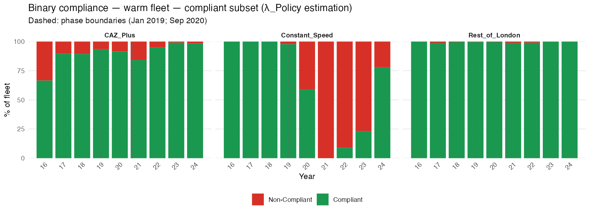
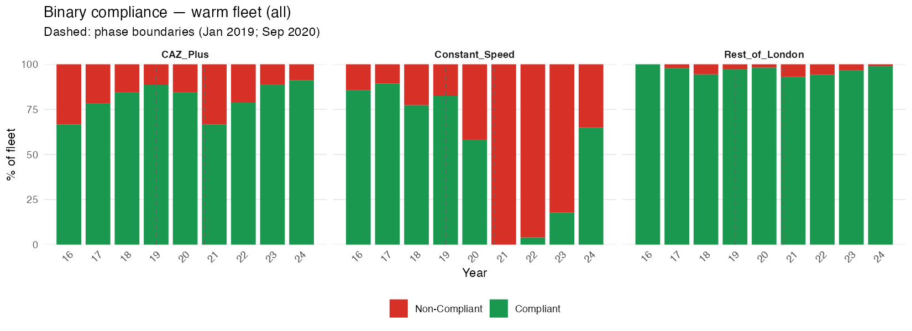

# London NRMM LEZ: Compliance Effect Analysis

**Date:** 31 March 2026 \| **Data period:** 2016–2024 \| **Research Plan:** v1.18 **n = 10,749 audit records across three equipment groups**

------------------------------------------------------------------------

## 1. Executive Summary

Analysis of London NRMM LEZ audit data (2016–2024) classifies every audit record into one of eight compliance routing outcomes, then decomposes the observed stage-based compliance improvement into three causal components: natural market turnover (counterfactual), voluntary proactive LEZ response, and direct enforcement.

**Principal findings:**

-   **59.7% of all audit records are self-compliant** at initial audit — machines at registered sites meeting the emissions stage requirement with no enforcement action required.
-   **22.2% are driven compliant via registration** — machines with acceptable emissions stage that were not registered; no stage change results from enforcement in this group.
-   Only **8.7% of all records** involve a machine below the emissions stage threshold that is either removed from site (5.2%) or driven to compliance (3.5%) — these are the records that produce actual emissions change through enforcement.
-   The stage-based non-compliance rate across all records is **13.8%** of the warm fleet, compared to 29.6% when measured from `Initial.Machinery.Compliance` directly. The gap is entirely explained by registration-only non-compliance, which produces no stage change.
-   Rest of London Phase B stage non-compliance is only **4.0%** — the RoL fleet was already largely at or above the IIIB threshold. The much higher `Initial.Machinery.Compliance` non-compliance rate (28.1%) in RoL reflects unregistered machines, not emissions failures.
-   The voluntary proactive LEZ response (λ_Proactive) is detectable across all groups once the estimation sample is restricted to self-compliant warm records.

------------------------------------------------------------------------

## 2. Data and Fleet Structure

### 2.1 Equipment Groups

| Group | Description | Phase B emissions threshold |
|------------------------|------------------------|------------------------|
| **Constant Speed** | Generators and constant-speed plant | Stage V |
| **CAZ+** | Variable-speed equipment in Central Activity Zone and Olympic Area | Stage IV |
| **Rest of London** | Variable-speed equipment in Greater London outside CAZ+ | Stage IIIB |

Stage integer mapping: I=1, II=2, IIIA=3, IIIB=4, IV=5, V=6, ZE=7.

### 2.2 Model Phases

| Phase | Period                | Key change                                  |
|------------------------|------------------------|------------------------|
| A1    | 1.1.2016 – 31.12.2018 | Initial programme                           |
| A2    | 1.1.2019 – 31.8.2020  | Stage V equipment newly available           |
| B     | 1.9.2020 – 31.12.2024 | Threshold step-up (CS→V, CAZ+→IV, RoL→IIIB) |

Phase B is subdivided into three equal segments (\~527 days) for variable speed estimation. Segment midpoints: 2021.389, 2022.832, 2024.278.

------------------------------------------------------------------------

## 3. Compliance Routing Classification

Every audit record is assigned to one of eight routing outcomes using three data fields: `Initial.Stage` vs threshold (emissions OK?), `Initial.Machinery.Compliance`, and `Final.Machinery.Compliance`.

### 3.1 Routing Rules

| Routing | Emissions OK? | `Initial.Machinery.Compliance` | Final outcome | Emissions change? |
|---------------|---------------|---------------|---------------|---------------|
| Self-compliant | ✓ | compliant | — | No |
| Compliant — exemption/viability | ✗ | compliant | — | No |
| Driven compliant — registration | ✓ | non-compliant | compliant | No |
| Removed — registration | ✓ | non-compliant | removed | No |
| Non-compliant — registration | ✓ | non-compliant | unresolved | No |
| Driven compliant — emissions | ✗ | non-compliant | compliant | **Yes** |
| Removed — emissions | ✗ | non-compliant | removed | **Yes** |
| Non-compliant — emissions | ✗ | non-compliant | unresolved | No |

Only the two emissions rows (driven compliant — emissions; removed — emissions) produce a stage transition through enforcement.

### 3.2 Overall Routing Counts — All Records

| Routing                         | n          | \%    |
|---------------------------------|------------|-------|
| Self-compliant                  | 6,417      | 59.7% |
| Driven compliant — registration | 2,388      | 22.2% |
| Removed — emissions             | 557        | 5.2%  |
| Driven compliant — emissions    | 380        | 3.5%  |
| Compliant — exemption/viability | 374        | 3.5%  |
| Non-compliant — registration    | 356        | 3.3%  |
| Non-compliant — emissions       | 216        | 2.0%  |
| Removed — registration          | 61         | 0.6%  |
| **Total**                       | **10,749** |       |

The registration-driven routes (driven compliant — registration, removed — registration, non-compliant — registration) together account for **26.1%** of all records. None of these produce a stage change.

### 3.3 Year-by-Year Routing — All Records, Warm Fleet, Cold Fleet

The chart below shows the compliance routing composition for each group over time. Rows show cold fleet (top), warm fleet (middle), and all records combined (bottom).

**Key patterns visible in the chart:**

-   The step-up in enforcement activity at the Phase B boundary (Sep 2020) is clearly visible across all groups as an increase in the emissions-driven routes.
-   Constant Speed shows a pronounced shift in 2021–2022: the "compliant — exemption/viability" and "driven compliant — emissions" categories together dominate, reflecting the abrupt Stage V threshold leaving most CS machines non-compliant and many granted viability stays.
-   Rest of London's non-self-compliant mass in Phase B is almost entirely "driven compliant — registration" — confirming that the RoL fleet was already emissions-compliant but had significant unregistered machines.
-   CAZ+ shows a sustained and growing "driven compliant — registration" component from 2019 onwards, alongside a persistent "removed — emissions" component throughout Phase B.

### 3.4 Routing by Group × Phase

| Group | Phase | Self-compliant | Driven compliant — reg | Driven compliant — emis | Removed — emis | Compliant — exemption | Non-compliant — reg | Non-compliant — emis | Removed — reg |
|--------|--------|--------|--------|--------|--------|--------|--------|--------|--------|
| CAZ+ | A1 | 266 | 23 | 1 | 17 | 33 | 30 | 30 | — |
| CAZ+ | A2 | 409 | 128 | 15 | 20 | 24 | 43 | 15 | 4 |
| CAZ+ | B | 1,393 | 385 | 109 | 226 | 82 | 46 | 40 | 11 |
| CS | A1 | 74 | 5 | — | 6 | — | 2 | 17 | — |
| CS | A2 | 142 | 115 | — | 40 | 2 | 12 | 4 | 1 |
| CS | B | 81 | 35 | 231 | 77 | 215 | 2 | 50 | 1 |
| RoL | A1 | 493 | 15 | 2 | 9 | 3 | 2 | 14 | — |
| RoL | A2 | 1,045 | 448 | 6 | 34 | 2 | 77 | 11 | 11 |
| RoL | B | 2,514 | 1,234 | — | — | — | — | — | — |

> RoL Phase B rows are truncated in the console output — full counts available in `260331_routing_console.txt`.

**Constant Speed Phase B** is structurally unlike any other cell: 215 records are compliant via exemption/viability (machines below Stage V threshold but granted a stay), and 231 are driven compliant via emissions enforcement. Only 81 records are self-compliant. This group is almost entirely in enforcement or exemption territory throughout Phase B.

------------------------------------------------------------------------

## 4. Decomposition Framework

The routing classification directly informs which data subset is appropriate for each parameter estimate.

### 4.1 Three-Component Model

$$\lambda_{Policy} = \lambda_{CF} + \lambda_{Proactive}$$

| Component | Symbol | Estimated from | Routing rows used |
|------------------|------------------|------------------|------------------|
| Counterfactual rate | $\lambda_{CF}$ | Cold-engaged fleet, stage distribution | All cold records |
| Policy rate | $\lambda_{Policy}$ | Warm fleet, self-compliant records only | Self-compliant (warm) |
| Proactive rate | $\lambda_{Proactive}$ | Derived: $\lambda_{Policy} - \lambda_{CF}$, floored at 0 | — |
| Enforcement exposure | $\bar{e}$ | All records, stage \< threshold | Driven compliant — emissions + Removed — emissions + Non-compliant — emissions |

### 4.2 ē Definition

$$\bar{e}_{g,\phi} = \frac{\#\{records : \text{Initial.Stage} < \text{threshold}_{g,\phi}\}}{N_{g,\phi}^{all}}$$

This counts only records where the machine's emissions stage was below the threshold — the routing rows that can produce a stage change through enforcement. Registration-only non-compliance is excluded.

### 4.3 WLS Estimator

$$\frac{\Delta p_{c,t}}{\Delta t} = \lambda \cdot (1 - p_{c,t})$$

Estimated by WLS regressing $\Delta p_c / \Delta t$ on $(1 - p_{c,t})$, weighted by $n_t$, no intercept. Standard errors from the WLS covariance matrix; 95% CI = ±1.96 SE.

------------------------------------------------------------------------

## 5. Counterfactual Rate (λ_CF)

λ_CF measures the annual rate at which the fleet would have moved toward the emissions stage threshold without LEZ intervention.

### 5.1 Cold Fleet Compliance Profiles

### 5.2 Stream A Binary Estimates (Indicative)

| Case | λ_CF | SE | 95% CI | Significant? |
|---------------|---------------|---------------|---------------|---------------|
| A1/A2 Variable Speed pooled | 0.130 | 0.198 | \[−0.257, 0.517\] | No |
| CS Phase A (IIIA threshold) | −0.107 | 0.417 | \[−0.925, 0.710\] | No — noise artefact |
| CS Phase B (V threshold) | 0.000 | — | — | By inspection |
| CAZ+ Phase B (IV, 3-seg) | 0.161 | 0.143 | \[−0.119, 0.442\] | No |
| RoL Phase B (IIIB, 3-seg) | 0.152 | 0.157 | \[−0.156, 0.460\] | No |

CS Phase A binary λ_CF = −0.107 is a noise artefact (n=9 cold CS records in 2020). CS Phase B λ_CF = 0 is confirmed by inspection: no Stage V machinery in the cold CS fleet 2021–2023.

### 5.3 Stream B Granular Estimates (Authoritative)

| Group          | λ_CF      | SE    | 95% CI           |
|----------------|-----------|-------|------------------|
| Constant Speed | **0.358** | 0.067 | \[0.226, 0.490\] |
| CAZ+           | **0.363** | 0.052 | \[0.261, 0.464\] |
| Rest of London | **0.219** | 0.048 | \[0.125, 0.313\] |

### 5.4 Bias Direction

The cold fleet overestimates the true counterfactual rate: LEZ-driven demand elevates the stage composition of second-hand equipment entering cold sites. λ_CF is therefore a conservative upper bound; λ_Proactive is a conservative lower bound.

------------------------------------------------------------------------

## 6. Enforcement Exposure (ē)

ē counts records with `Initial.Stage` below threshold across all records (cold + warm). Cold records are included because cold machines below threshold are subject to the same enforcement as warm machines.

### 6.1 ē by Group × Phase — Stage-Threshold Definition

| Group          | Phase | n_all | n (Stage \< threshold) | ē         |
|----------------|-------|-------|------------------------|-----------|
| Constant Speed | A1    | 104   | 23                     | 0.221     |
| Constant Speed | A2    | 316   | 56                     | 0.177     |
| Constant Speed | B     | 692   | 492                    | **0.711** |
| CAZ+           | A1    | 400   | 48                     | 0.120     |
| CAZ+           | A2    | 658   | 50                     | 0.076     |
| CAZ+           | B     | 2,292 | 457                    | 0.199     |
| Rest of London | A1    | 538   | 26                     | 0.048     |
| Rest of London | A2    | 1,634 | 52                     | 0.032     |
| Rest of London | B     | 4,115 | 162                    | **0.039** |

### 6.2 Comparison: Stage-Threshold vs `Initial.Machinery.Compliance` Non-compliance (Warm Fleet)

| Group | Phase | Stage ē (warm) | `Initial.Machinery.Compliance` ē (warm) | Gap    |
|---------------|---------------|---------------|---------------|---------------|
| CAZ+  | A1    | 0.186          | 0.178                                   | −0.008 |
| CAZ+  | A2    | 0.095          | 0.282                                   | +0.187 |
| CAZ+  | B     | 0.192          | 0.310                                   | +0.118 |
| CS    | A1    | 0.182          | 0.261                                   | +0.079 |
| CS    | A2    | 0.122          | 0.500                                   | +0.378 |
| CS    | B     | **0.828**      | 0.526                                   | −0.302 |
| RoL   | A1    | 0.038          | 0.064                                   | +0.026 |
| RoL   | A2    | 0.025          | 0.285                                   | +0.260 |
| RoL   | B     | 0.040          | **0.281**                               | +0.241 |

The positive gaps (most groups/phases) show where `Initial.Machinery.Compliance` overcounts enforcement exposure by including registration-only failures. The negative gap for CS Phase B shows the reverse: many CS machines are Stage \< V but `Initial.Machinery.Compliance` = compliant because they hold viability exemptions (215 records in Phase B).

**Rest of London Phase B** is the most important case: stage-based ē = 4.0% vs `Initial.Machinery.Compliance` ē = 28.1%. The 24 percentage point gap represents registration-only non-compliance producing no stage change.

------------------------------------------------------------------------

## 7. Policy Rate (λ_Policy) and Proactive Attribution

λ_Policy is estimated from the **self-compliant warm subset** only — routing row "Self-compliant" in the warm fleet. This is the population of machines that met the emissions stage requirement and were registered at their audit. Their compliance trajectory over time captures the voluntary proactive LEZ policy response free from enforcement contamination.

### 7.1 Self-Compliant Warm Subset

**Full warm fleet (all routing types) for comparison:**

### 7.2 λ_Policy Estimates

| Case | n (self-compliant warm) | p_c progression | λ_Policy | SE | 95% CI | Significant? |
|-----------|-----------|-----------|-----------|-----------|-----------|-----------|
| A1/A2 Variable Speed pooled | 2,094 | 87.9% → 98.4% | **0.361** | 0.162 | \[0.043, 0.679\] | Yes |
| CS Phase A | 194 | \~100% throughout | 1.000† | 0.434 | — | Artefact |
| CS Phase B | 252 | 0% → 23.3% → 78.1% | **0.264** | 0.182 | \[−0.093, 0.620\] | Marginal |
| CAZ+ Phase B | 1,416 | 84.0% → 96.5% → 98.7% | **0.536** | 0.024 | \[0.490, 0.582\] | **Yes — high precision** |
| RoL Phase B | 2,298 | 99.0% → 99.3% → 99.9% | **0.338** | 0.177 | \[−0.010, 0.685\] | Marginal |

†CS Phase A: near-perfect compliance throughout the self-compliant warm subset leaves insufficient variance. Estimate is a ceiling artefact; excluded from decomposition.

------------------------------------------------------------------------

## 8. Full Decomposition

$$\lambda_{Proactive} = \lambda_{Policy} - \lambda_{CF} \quad [\text{floored at 0}]$$

| Case | λ_CF | λ_Policy | λ_Proactive | ē | λ_Pro / λ_Policy | Reliability |
|-----------|-----------|-----------|-----------|-----------|-----------|-----------|
| A1/A2 Var Speed pooled | 0.130 | 0.361 | **0.231** | 0.076 | 64% | Good |
| CS Phase A | −0.107† | 1.000† | 1.107† | 0.199 | — | **Unreliable** |
| CS Phase B | 0.000 | 0.264 | **0.264** | 0.711 | 100% | Moderate |
| CAZ+ Phase B | 0.161 | 0.536 | **0.375** | 0.199 | 70% | **Excellent** |
| RoL Phase B | 0.152 | 0.338 | **0.186** | 0.039 | 55% | Moderate |

### 8.1 Interpretation

**Variable Speed A1/A2:** In the early programme, the self-compliant VS warm fleet improved at 0.361/yr against a cold-fleet counterfactual of 0.130/yr. The proactive response (0.231/yr) accounts for 64% of the voluntary improvement — operators were upgrading at nearly double the natural market rate.

**CS Phase B:** λ_CF = 0 means no Stage V replacement would have occurred without the LEZ. Every unit of voluntary compliance improvement in the self-compliant CS fleet is attributable to the proactive LEZ response. Meanwhile ē = 0.711 — over 70% of all CS Phase B records present machines below the Stage V threshold, reflecting the abrupt mandate. CS Phase B is simultaneously a high-enforcement and high-proactive-response group.

**CAZ+ Phase B:** The most precisely estimated case. 84% → 98.7% compliance in the self-compliant warm subset over Phase B. After subtracting the natural rate (0.161), the proactive response (0.375/yr) is the largest of any group. With ē = 0.199, both proactive and enforcement channels are active and substantial.

**RoL Phase B:** A genuine but modest proactive response (0.186/yr) and very low enforcement exposure against stage threshold (ē = 0.039). The RoL fleet was already largely above the IIIB threshold — the policy effect here is predominantly through registration compliance rather than stage upgrading.

------------------------------------------------------------------------

## 9. Summary of Key Results

| Finding | Value |
|------------------------------------|------------------------------------|
| Self-compliant at initial audit (all records) | **59.7%** (6,417) |
| Driven compliant — registration (no stage change) | **22.2%** (2,388) |
| Driven compliant or removed — emissions (stage change) | **8.7%** (937) |
| Compliant via exemption/viability | **3.5%** (374) |
| Persistent non-compliant | **5.3%** (572) |
| Stage non-compliance rate — warm fleet only | **13.8%** |
| `Initial.Machinery.Compliance` non-compliance — warm fleet | 29.6% |
| λ_CF — CS | 0.358/yr \[0.226, 0.490\] |
| λ_CF — CAZ+ | 0.363/yr \[0.261, 0.464\] |
| λ_CF — RoL | 0.219/yr \[0.125, 0.313\] |
| λ_Policy — CAZ+ Phase B (most reliable) | **0.536/yr** \[0.490, 0.582\] |
| λ_Proactive — CAZ+ Phase B | **0.375/yr** (70% of λ_Policy) |
| λ_Proactive — CS Phase B | **0.264/yr** (100% of λ_Policy; λ_CF = 0) |
| ē — CS Phase B (highest) | **0.711** |
| ē — RoL Phase B (lowest) | **0.039** |

------------------------------------------------------------------------

## 10. Caveats

| \# | Caveat | Affected finding |
|------------------------|------------------------|------------------------|
| 1 | **CS Phase A parameters unreliable** — ceiling artefact in λ_Policy, noise artefact in λ_CF (n=9 cold sample). | CS Phase A row excluded from conclusions. |
| 2 | **λ_CF overestimates natural rate** — LEZ demand elevates second-hand stock entering cold sites. | λ_Proactive is a conservative lower bound. |
| 3 | **RoL Phase B routing table truncated** in console output — full year-by-year counts available in `260331_routing_console.txt`. | Minor; totals confirmed from aggregate counts. |
| 4 | **`ID` field 51% populated** — individual machine tracking across cold and warm visits is partial. | 131 tracked machines with both cold and warm records is an undercount. |
| 5 | **CS Phase B λ_Policy is marginal** (95% CI includes 0) — compliance growth was concentrated in 2023–2024 as the 2025 mandate approached. | Directionally reliable but uncertain in magnitude. |
| 6 | **Ecological inference** — rates estimated from aggregate annual proportions, not individual machine trajectories. | Individual hazard rates may differ from group averages. |

------------------------------------------------------------------------

*Scripts: `260329_step1_ingestion.R`, `260329_step2_exploratory.R`, `260329_step3_lambda_diagnostics.R`, `260329_step3b_lambda_temporal.R`, `260329_step3c_cs_lambda.R`, `260330_step4_parameter_estimation.R`, `260331_step4_revised.R`, `260330_diagnostic_enforcement.R`, `260331_routing_classification.R`*

*Data objects: `260329_step1_ingestion.RData`, `260329_step2_exploratory.RData`, `260331_step4_revised_parameters.RData`*