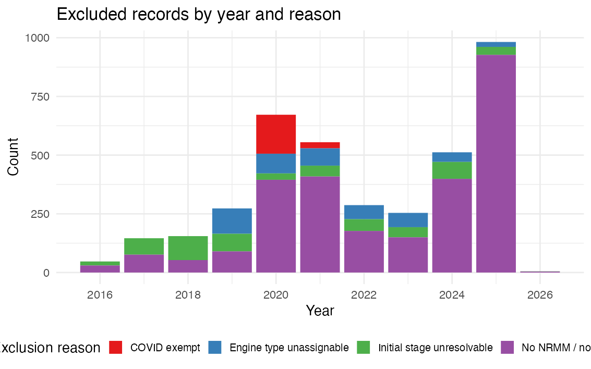
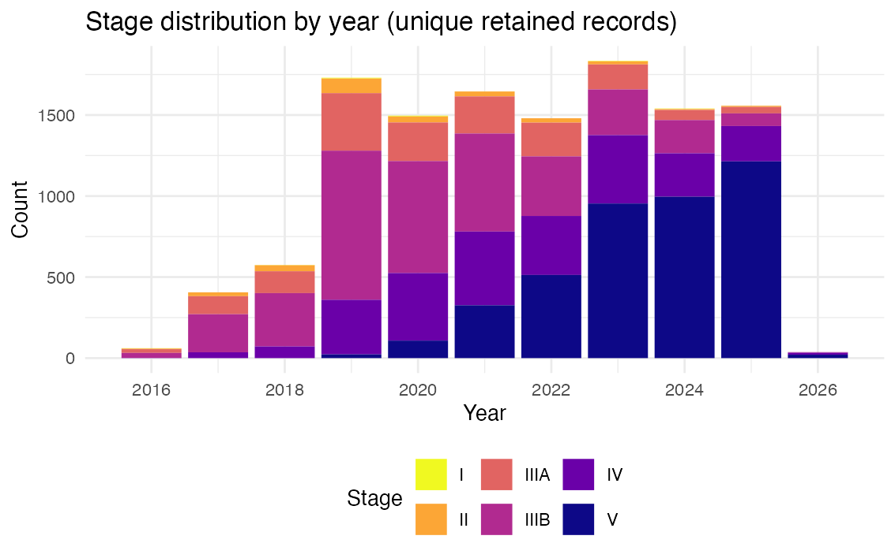
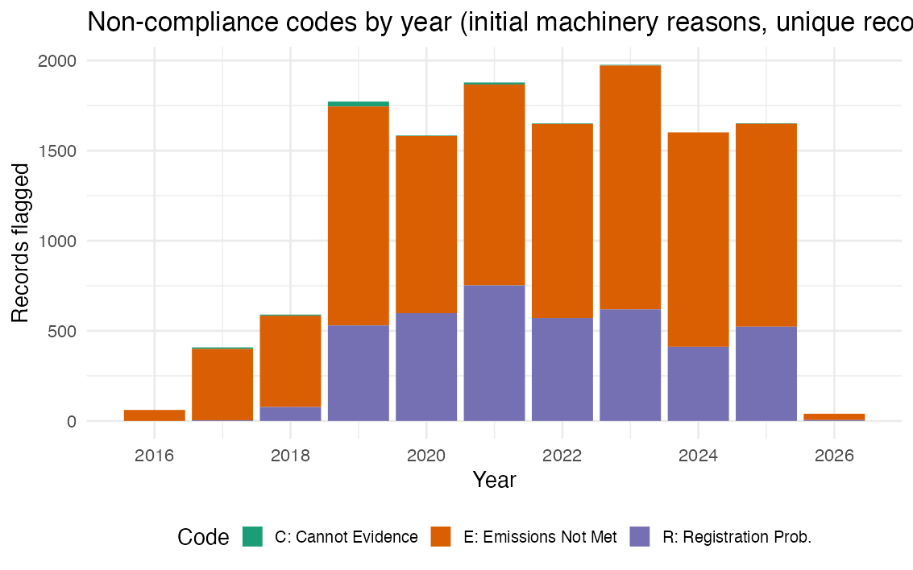
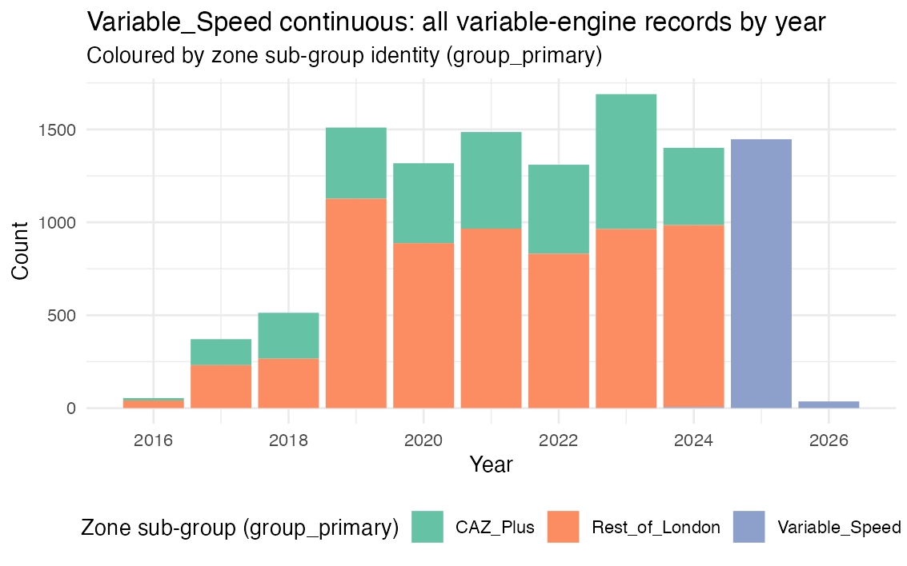

# Step 1 Outputs — 260421_step1_ingestion_v3

Generated: 2026-04-21 21:41:14

## Step 1.1–1.4 Record Counts

### Note on row structure

audits.rds contains **22011 rows** representing **12363 unique audit records** plus **9648 duplicate rows** for the Variable_Speed continuous series (CAZ_Plus and Rest_of_London records also appear with group = 'Variable_Speed'). Use `filter(group == group_primary)` to work with unique records only.

### Unique records by primary group × phase

<table class="table table-condensed" style="width: auto !important; margin-left: auto; margin-right: auto;">
<caption>Unique audit records by primary group × phase</caption>
 <thead>
<tr>
<th style="empty-cells: hide;border-bottom:hidden;" colspan="1"></th>
<th style="border-bottom:hidden;padding-bottom:0; padding-left:3px;padding-right:3px;text-align: center; " colspan="4">
Phase
</th>
<th style="empty-cells: hide;border-bottom:hidden;" colspan="1"></th>
</tr>
  <tr>
   <th style="text-align:left;"> group </th>
   <th style="text-align:right;"> A1 </th>
   <th style="text-align:right;"> A2 </th>
   <th style="text-align:right;"> B </th>
   <th style="text-align:right;"> C </th>
   <th style="text-align:right;"> Total </th>
  </tr>
 </thead>
<tbody>
  <tr>
   <td style="text-align:left;"> CAZ_Plus </td>
   <td style="text-align:right;"> 400 </td>
   <td style="text-align:right;"> 658 </td>
   <td style="text-align:right;"> 2296 </td>
   <td style="text-align:right;"> 0 </td>
   <td style="text-align:right;"> 3354 </td>
  </tr>
  <tr>
   <td style="text-align:left;"> Constant_Speed </td>
   <td style="text-align:right;"> 104 </td>
   <td style="text-align:right;"> 318 </td>
   <td style="text-align:right;"> 693 </td>
   <td style="text-align:right;"> 112 </td>
   <td style="text-align:right;"> 1227 </td>
  </tr>
  <tr>
   <td style="text-align:left;"> Rest_of_London </td>
   <td style="text-align:right;"> 538 </td>
   <td style="text-align:right;"> 1634 </td>
   <td style="text-align:right;"> 4122 </td>
   <td style="text-align:right;"> 0 </td>
   <td style="text-align:right;"> 6294 </td>
  </tr>
  <tr>
   <td style="text-align:left;"> Variable_Speed </td>
   <td style="text-align:right;"> 0 </td>
   <td style="text-align:right;"> 0 </td>
   <td style="text-align:right;"> 5 </td>
   <td style="text-align:right;"> 1483 </td>
   <td style="text-align:right;"> 1488 </td>
  </tr>
</tbody>
</table>

One row per unique audit record; group_primary is the 4-way zone assignment. NA_phase = pre-2016 or between-boundary records.
Rest_of_London dominates the record count; Variable_Speed (P24) records appear in Phase C only.

### Cold-engaged unique records by primary group × phase

<table class="table table-condensed" style="width: auto !important; margin-left: auto; margin-right: auto;">
<caption>Cold-engaged unique records by group × phase</caption>
 <thead>
<tr>
<th style="empty-cells: hide;border-bottom:hidden;" colspan="1"></th>
<th style="border-bottom:hidden;padding-bottom:0; padding-left:3px;padding-right:3px;text-align: center; " colspan="4">
Phase
</th>
<th style="empty-cells: hide;border-bottom:hidden;" colspan="1"></th>
</tr>
  <tr>
   <th style="text-align:left;"> group </th>
   <th style="text-align:right;"> A1 </th>
   <th style="text-align:right;"> A2 </th>
   <th style="text-align:right;"> B </th>
   <th style="text-align:right;"> C </th>
   <th style="text-align:right;"> Total </th>
  </tr>
 </thead>
<tbody>
  <tr>
   <td style="text-align:left;"> CAZ_Plus </td>
   <td style="text-align:right;"> 51 </td>
   <td style="text-align:right;"> 69 </td>
   <td style="text-align:right;"> 241 </td>
   <td style="text-align:right;"> 0 </td>
   <td style="text-align:right;"> 361 </td>
  </tr>
  <tr>
   <td style="text-align:left;"> Constant_Speed </td>
   <td style="text-align:right;"> 16 </td>
   <td style="text-align:right;"> 46 </td>
   <td style="text-align:right;"> 99 </td>
   <td style="text-align:right;"> 13 </td>
   <td style="text-align:right;"> 174 </td>
  </tr>
  <tr>
   <td style="text-align:left;"> Rest_of_London </td>
   <td style="text-align:right;"> 88 </td>
   <td style="text-align:right;"> 288 </td>
   <td style="text-align:right;"> 918 </td>
   <td style="text-align:right;"> 0 </td>
   <td style="text-align:right;"> 1294 </td>
  </tr>
  <tr>
   <td style="text-align:left;"> Variable_Speed </td>
   <td style="text-align:right;"> 0 </td>
   <td style="text-align:right;"> 0 </td>
   <td style="text-align:right;"> 0 </td>
   <td style="text-align:right;"> 324 </td>
   <td style="text-align:right;"> 324 </td>
  </tr>
</tbody>
</table>

Cold-engaged records used for λ_CF estimation; distribution mirrors all-records pattern at lower counts.
Constant_Speed cold sample is notably sparse relative to variable-engine groups.

### Warm-engaged unique records by primary group × phase

<table class="table table-condensed" style="width: auto !important; margin-left: auto; margin-right: auto;">
<caption>Warm-engaged unique records by group × phase</caption>
 <thead>
<tr>
<th style="empty-cells: hide;border-bottom:hidden;" colspan="1"></th>
<th style="border-bottom:hidden;padding-bottom:0; padding-left:3px;padding-right:3px;text-align: center; " colspan="4">
Phase
</th>
<th style="empty-cells: hide;border-bottom:hidden;" colspan="1"></th>
</tr>
  <tr>
   <th style="text-align:left;"> group </th>
   <th style="text-align:right;"> A1 </th>
   <th style="text-align:right;"> A2 </th>
   <th style="text-align:right;"> B </th>
   <th style="text-align:right;"> C </th>
   <th style="text-align:right;"> Total </th>
  </tr>
 </thead>
<tbody>
  <tr>
   <td style="text-align:left;"> CAZ_Plus </td>
   <td style="text-align:right;"> 349 </td>
   <td style="text-align:right;"> 589 </td>
   <td style="text-align:right;"> 2055 </td>
   <td style="text-align:right;"> 0 </td>
   <td style="text-align:right;"> 2993 </td>
  </tr>
  <tr>
   <td style="text-align:left;"> Constant_Speed </td>
   <td style="text-align:right;"> 88 </td>
   <td style="text-align:right;"> 272 </td>
   <td style="text-align:right;"> 594 </td>
   <td style="text-align:right;"> 99 </td>
   <td style="text-align:right;"> 1053 </td>
  </tr>
  <tr>
   <td style="text-align:left;"> Rest_of_London </td>
   <td style="text-align:right;"> 450 </td>
   <td style="text-align:right;"> 1346 </td>
   <td style="text-align:right;"> 3204 </td>
   <td style="text-align:right;"> 0 </td>
   <td style="text-align:right;"> 5000 </td>
  </tr>
  <tr>
   <td style="text-align:left;"> Variable_Speed </td>
   <td style="text-align:right;"> 0 </td>
   <td style="text-align:right;"> 0 </td>
   <td style="text-align:right;"> 5 </td>
   <td style="text-align:right;"> 1159 </td>
   <td style="text-align:right;"> 1164 </td>
  </tr>
</tbody>
</table>

Warm records used for λ_Proactive estimation (self-compliant warm subset).
Warm counts mirror the all-records distribution; no systematic engagement-type bias by phase.

### Expanded record counts (includes Variable_Speed continuous rows)

<table class="table table-condensed" style="width: auto !important; margin-left: auto; margin-right: auto;">
<caption>Expanded audits row counts by group × phase</caption>
 <thead>
<tr>
<th style="empty-cells: hide;border-bottom:hidden;" colspan="1"></th>
<th style="border-bottom:hidden;padding-bottom:0; padding-left:3px;padding-right:3px;text-align: center; " colspan="4">
Phase
</th>
<th style="empty-cells: hide;border-bottom:hidden;" colspan="1"></th>
</tr>
  <tr>
   <th style="text-align:left;"> group </th>
   <th style="text-align:right;"> A1 </th>
   <th style="text-align:right;"> A2 </th>
   <th style="text-align:right;"> B </th>
   <th style="text-align:right;"> C </th>
   <th style="text-align:right;"> Total </th>
  </tr>
 </thead>
<tbody>
  <tr>
   <td style="text-align:left;"> CAZ_Plus </td>
   <td style="text-align:right;"> 400 </td>
   <td style="text-align:right;"> 658 </td>
   <td style="text-align:right;"> 2296 </td>
   <td style="text-align:right;"> 0 </td>
   <td style="text-align:right;"> 3354 </td>
  </tr>
  <tr>
   <td style="text-align:left;"> Constant_Speed </td>
   <td style="text-align:right;"> 104 </td>
   <td style="text-align:right;"> 318 </td>
   <td style="text-align:right;"> 693 </td>
   <td style="text-align:right;"> 112 </td>
   <td style="text-align:right;"> 1227 </td>
  </tr>
  <tr>
   <td style="text-align:left;"> Rest_of_London </td>
   <td style="text-align:right;"> 538 </td>
   <td style="text-align:right;"> 1634 </td>
   <td style="text-align:right;"> 4122 </td>
   <td style="text-align:right;"> 0 </td>
   <td style="text-align:right;"> 6294 </td>
  </tr>
  <tr>
   <td style="text-align:left;"> Variable_Speed </td>
   <td style="text-align:right;"> 938 </td>
   <td style="text-align:right;"> 2292 </td>
   <td style="text-align:right;"> 6423 </td>
   <td style="text-align:right;"> 1483 </td>
   <td style="text-align:right;"> 11136 </td>
  </tr>
</tbody>
</table>

Variable_Speed row shows all variable-engine records across A1–C, enabling continuous trend analysis.
CAZ_Plus and Rest_of_London total within each phase equals their contribution to Variable_Speed; the sum across all four groups exceeds n_unique_records by n_vs_dupes.

## Step 1.4 Checksum Analysis

<table class="table table-condensed" style="width: auto !important; margin-left: auto; margin-right: auto;">
<caption>Exclusion pipeline and row counts</caption>
 <thead>
  <tr>
   <th style="text-align:left;"> stage </th>
   <th style="text-align:right;"> n </th>
  </tr>
 </thead>
<tbody>
  <tr>
   <td style="text-align:left;"> Raw records imported </td>
   <td style="text-align:right;"> 16251 </td>
  </tr>
  <tr>
   <td style="text-align:left;"> Excluded — No NRMM / non-machinery </td>
   <td style="text-align:right;"> 2710 </td>
  </tr>
  <tr>
   <td style="text-align:left;"> Excluded — Zone out of scope </td>
   <td style="text-align:right;"> 0 </td>
  </tr>
  <tr>
   <td style="text-align:left;"> Excluded — Engine type unassignable </td>
   <td style="text-align:right;"> 449 </td>
  </tr>
  <tr>
   <td style="text-align:left;"> Excluded — Initial stage unresolvable </td>
   <td style="text-align:right;"> 537 </td>
  </tr>
  <tr>
   <td style="text-align:left;"> Excluded — COVID exempt </td>
   <td style="text-align:right;"> 192 </td>
  </tr>
  <tr>
   <td style="text-align:left;"> Total excluded </td>
   <td style="text-align:right;"> 3888 </td>
  </tr>
  <tr>
   <td style="text-align:left;"> Unique records retained </td>
   <td style="text-align:right;"> 12363 </td>
  </tr>
  <tr>
   <td style="text-align:left;"> VS duplicate rows added </td>
   <td style="text-align:right;"> 9648 </td>
  </tr>
  <tr>
   <td style="text-align:left;"> Total rows in audits.rds </td>
   <td style="text-align:right;"> 22011 </td>
  </tr>
</tbody>
</table>

<table class="table table-condensed" style="width: auto !important; margin-left: auto; margin-right: auto;">
<caption>Row counts by group (expanded audits)</caption>
 <thead>
  <tr>
   <th style="text-align:left;"> group </th>
   <th style="text-align:right;"> n_rows </th>
   <th style="text-align:left;"> note </th>
  </tr>
 </thead>
<tbody>
  <tr>
   <td style="text-align:left;"> Constant_Speed </td>
   <td style="text-align:right;"> 1227 </td>
   <td style="text-align:left;">  </td>
  </tr>
  <tr>
   <td style="text-align:left;"> CAZ_Plus </td>
   <td style="text-align:right;"> 3354 </td>
   <td style="text-align:left;">  </td>
  </tr>
  <tr>
   <td style="text-align:left;"> Rest_of_London </td>
   <td style="text-align:right;"> 6294 </td>
   <td style="text-align:left;">  </td>
  </tr>
  <tr>
   <td style="text-align:left;"> Variable_Speed </td>
   <td style="text-align:right;"> 11136 </td>
   <td style="text-align:left;"> includes CAZ_Plus + RoL duplicates </td>
  </tr>
  <tr>
   <td style="text-align:left;"> TOTAL </td>
   <td style="text-align:right;"> 22011 </td>
   <td style="text-align:left;"> = unique + VS dupes </td>
  </tr>
</tbody>
</table>

Variable_Speed row count equals the sum of all variable-engine unique records (CAZ_Plus + Rest_of_London + P24 Variable_Speed), confirming the row duplication is complete.
The TOTAL row exceeds n_unique_records by n_vs_dupes; this is expected and intentional — each CAZ_Plus and Rest_of_London record appears twice in audits.rds.

<table class="table table-condensed" style="width: auto !important; margin-left: auto; margin-right: auto;">
<caption>Checksum verification — Step 1.4</caption>
 <thead>
  <tr>
   <th style="text-align:left;"> check </th>
   <th style="text-align:right;"> lhs </th>
   <th style="text-align:right;"> rhs </th>
   <th style="text-align:left;"> result </th>
  </tr>
 </thead>
<tbody>
  <tr>
   <td style="text-align:left;"> raw = unique_retained + total_excluded </td>
   <td style="text-align:right;"> 16251 </td>
   <td style="text-align:right;"> 16251 </td>
   <td style="text-align:left;"> PASS </td>
  </tr>
  <tr>
   <td style="text-align:left;"> sum(primary group counts) = n_unique_records </td>
   <td style="text-align:right;"> 12363 </td>
   <td style="text-align:right;"> 12363 </td>
   <td style="text-align:left;"> PASS </td>
  </tr>
  <tr>
   <td style="text-align:left;"> VS rows = CAZ_Plus + RoL + P24_VS (unique) </td>
   <td style="text-align:right;"> 11136 </td>
   <td style="text-align:right;"> 11136 </td>
   <td style="text-align:left;"> PASS </td>
  </tr>
  <tr>
   <td style="text-align:left;"> cold + warm = n_unique_records </td>
   <td style="text-align:right;"> 12363 </td>
   <td style="text-align:right;"> 12363 </td>
   <td style="text-align:left;"> PASS </td>
  </tr>
  <tr>
   <td style="text-align:left;"> no NA group_primary values </td>
   <td style="text-align:right;"> 0 </td>
   <td style="text-align:right;"> 0 </td>
   <td style="text-align:left;"> PASS </td>
  </tr>
</tbody>
</table>

PASS on all rows confirms: pipeline exclusions are complete; group_primary assigns every unique record; Variable_Speed continuous series equals all variable-engine unique records.

## Step 1.5 Statistics and Charts

### 8a. Excluded records by year and reason

<table class="table table-condensed" style="width: auto !important; margin-left: auto; margin-right: auto;">
<caption>Excluded records by year and exclusion reason</caption>
 <thead>
  <tr>
   <th style="text-align:right;"> year </th>
   <th style="text-align:right;"> Initial stage unresolvable </th>
   <th style="text-align:right;"> No NRMM / non-machinery </th>
   <th style="text-align:right;"> Engine type unassignable </th>
   <th style="text-align:right;"> COVID exempt </th>
  </tr>
 </thead>
<tbody>
  <tr>
   <td style="text-align:right;"> 2016 </td>
   <td style="text-align:right;"> 17 </td>
   <td style="text-align:right;"> 30 </td>
   <td style="text-align:right;"> 0 </td>
   <td style="text-align:right;"> 0 </td>
  </tr>
  <tr>
   <td style="text-align:right;"> 2017 </td>
   <td style="text-align:right;"> 70 </td>
   <td style="text-align:right;"> 76 </td>
   <td style="text-align:right;"> 0 </td>
   <td style="text-align:right;"> 0 </td>
  </tr>
  <tr>
   <td style="text-align:right;"> 2018 </td>
   <td style="text-align:right;"> 102 </td>
   <td style="text-align:right;"> 53 </td>
   <td style="text-align:right;"> 0 </td>
   <td style="text-align:right;"> 0 </td>
  </tr>
  <tr>
   <td style="text-align:right;"> 2019 </td>
   <td style="text-align:right;"> 75 </td>
   <td style="text-align:right;"> 90 </td>
   <td style="text-align:right;"> 108 </td>
   <td style="text-align:right;"> 0 </td>
  </tr>
  <tr>
   <td style="text-align:right;"> 2020 </td>
   <td style="text-align:right;"> 27 </td>
   <td style="text-align:right;"> 395 </td>
   <td style="text-align:right;"> 84 </td>
   <td style="text-align:right;"> 166 </td>
  </tr>
  <tr>
   <td style="text-align:right;"> 2021 </td>
   <td style="text-align:right;"> 46 </td>
   <td style="text-align:right;"> 409 </td>
   <td style="text-align:right;"> 74 </td>
   <td style="text-align:right;"> 26 </td>
  </tr>
  <tr>
   <td style="text-align:right;"> 2022 </td>
   <td style="text-align:right;"> 50 </td>
   <td style="text-align:right;"> 177 </td>
   <td style="text-align:right;"> 60 </td>
   <td style="text-align:right;"> 0 </td>
  </tr>
  <tr>
   <td style="text-align:right;"> 2023 </td>
   <td style="text-align:right;"> 43 </td>
   <td style="text-align:right;"> 150 </td>
   <td style="text-align:right;"> 61 </td>
   <td style="text-align:right;"> 0 </td>
  </tr>
  <tr>
   <td style="text-align:right;"> 2024 </td>
   <td style="text-align:right;"> 72 </td>
   <td style="text-align:right;"> 399 </td>
   <td style="text-align:right;"> 41 </td>
   <td style="text-align:right;"> 0 </td>
  </tr>
  <tr>
   <td style="text-align:right;"> 2025 </td>
   <td style="text-align:right;"> 34 </td>
   <td style="text-align:right;"> 927 </td>
   <td style="text-align:right;"> 21 </td>
   <td style="text-align:right;"> 0 </td>
  </tr>
  <tr>
   <td style="text-align:right;"> 2026 </td>
   <td style="text-align:right;"> 1 </td>
   <td style="text-align:right;"> 4 </td>
   <td style="text-align:right;"> 0 </td>
   <td style="text-align:right;"> 0 </td>
  </tr>
</tbody>
</table>

Exclusion volume peaks in the Phase B window (2020–2024) driven by COVID exemptions and sustained BCP zone activity.
Non-machinery and stage-unresolvable exclusions are distributed across the full time series.

### 8b. Stage distribution by year — unique records

Stage distribution shifts from predominantly Stages II–IIIB in 2016 towards Stages IV–V from 2020 onwards.
Stage V becomes dominant by 2022–2023, reflecting progressive policy-driven fleet improvement.

Constant_Speed transitions sharply to Stage V from 2022; CAZ_Plus and Rest_of_London show a more gradual shift.
Variable_Speed (P24, Phase C) enters predominantly at Stage V, consistent with anticipatory pre-2025 compliance.

### 8c. Non-compliance codes by year (initial machinery reasons)

<table class="table table-condensed" style="width: auto !important; margin-left: auto; margin-right: auto;">
<caption>Non-compliance codes by year</caption>
 <thead>
  <tr>
   <th style="text-align:right;"> year </th>
   <th style="text-align:right;"> E: Emissions Not Met </th>
   <th style="text-align:right;"> C: Cannot Evidence </th>
   <th style="text-align:right;"> R: Registration Prob. </th>
  </tr>
 </thead>
<tbody>
  <tr>
   <td style="text-align:right;"> 2016 </td>
   <td style="text-align:right;"> 61 </td>
   <td style="text-align:right;"> 0 </td>
   <td style="text-align:right;"> 0 </td>
  </tr>
  <tr>
   <td style="text-align:right;"> 2017 </td>
   <td style="text-align:right;"> 396 </td>
   <td style="text-align:right;"> 8 </td>
   <td style="text-align:right;"> 4 </td>
  </tr>
  <tr>
   <td style="text-align:right;"> 2018 </td>
   <td style="text-align:right;"> 507 </td>
   <td style="text-align:right;"> 6 </td>
   <td style="text-align:right;"> 77 </td>
  </tr>
  <tr>
   <td style="text-align:right;"> 2019 </td>
   <td style="text-align:right;"> 1215 </td>
   <td style="text-align:right;"> 27 </td>
   <td style="text-align:right;"> 530 </td>
  </tr>
  <tr>
   <td style="text-align:right;"> 2020 </td>
   <td style="text-align:right;"> 983 </td>
   <td style="text-align:right;"> 3 </td>
   <td style="text-align:right;"> 598 </td>
  </tr>
  <tr>
   <td style="text-align:right;"> 2021 </td>
   <td style="text-align:right;"> 1115 </td>
   <td style="text-align:right;"> 11 </td>
   <td style="text-align:right;"> 752 </td>
  </tr>
  <tr>
   <td style="text-align:right;"> 2022 </td>
   <td style="text-align:right;"> 1077 </td>
   <td style="text-align:right;"> 3 </td>
   <td style="text-align:right;"> 571 </td>
  </tr>
  <tr>
   <td style="text-align:right;"> 2023 </td>
   <td style="text-align:right;"> 1353 </td>
   <td style="text-align:right;"> 4 </td>
   <td style="text-align:right;"> 619 </td>
  </tr>
  <tr>
   <td style="text-align:right;"> 2024 </td>
   <td style="text-align:right;"> 1190 </td>
   <td style="text-align:right;"> 0 </td>
   <td style="text-align:right;"> 411 </td>
  </tr>
  <tr>
   <td style="text-align:right;"> 2025 </td>
   <td style="text-align:right;"> 1126 </td>
   <td style="text-align:right;"> 3 </td>
   <td style="text-align:right;"> 523 </td>
  </tr>
  <tr>
   <td style="text-align:right;"> 2026 </td>
   <td style="text-align:right;"> 35 </td>
   <td style="text-align:right;"> 0 </td>
   <td style="text-align:right;"> 5 </td>
  </tr>
</tbody>
</table>

Code E (Emissions Not Met) dominates throughout; code R (Registration Problem) is next most frequent.
One record may carry multiple codes; the y-axis counts code occurrences, not unique records.

### 8d. Primary group and engagement type by year (unique records)

Rest_of_London dominates both cold and warm counts across all years; Constant_Speed is stable.
Variable_Speed (P24) appears from 2025 only in the primary-group view.

### 8e. Variable_Speed continuous by year — all variable-engine records

Variable_Speed is a continuous series from 2016 through 2026: CAZ_Plus and Rest_of_London records contribute through Phase B (to end-2024); Variable_Speed (P24) takes over in Phase C.
CAZ_Plus and Rest_of_London are 'discontinued' from 1.1.2025 because no new CAZ/OA/GL records exist after that date — the P24 zone supersedes them.

### 8f. Pre-2016 records (retained, NA phase)

No pre-2016 records in retained dataset.

## Step 1.6 Formal Checksum Verification

<table class="table table-condensed" style="width: auto !important; margin-left: auto; margin-right: auto;">
<caption>Full accounting: raw = unique_retained + excluded</caption>
 <thead>
  <tr>
   <th style="text-align:left;"> item </th>
   <th style="text-align:right;"> count </th>
   <th style="text-align:left;"> status </th>
  </tr>
 </thead>
<tbody>
  <tr>
   <td style="text-align:left;"> Raw records imported </td>
   <td style="text-align:right;"> 16251 </td>
   <td style="text-align:left;">  </td>
  </tr>
  <tr>
   <td style="text-align:left;"> Excluded — No NRMM / non-machinery </td>
   <td style="text-align:right;"> 2710 </td>
   <td style="text-align:left;">  </td>
  </tr>
  <tr>
   <td style="text-align:left;"> Excluded — Zone out of scope (BCP/other) </td>
   <td style="text-align:right;"> 0 </td>
   <td style="text-align:left;">  </td>
  </tr>
  <tr>
   <td style="text-align:left;"> Excluded — Engine type unassignable </td>
   <td style="text-align:right;"> 449 </td>
   <td style="text-align:left;">  </td>
  </tr>
  <tr>
   <td style="text-align:left;"> Excluded — Initial stage unresolvable </td>
   <td style="text-align:right;"> 537 </td>
   <td style="text-align:left;">  </td>
  </tr>
  <tr>
   <td style="text-align:left;"> Excluded — COVID exempt </td>
   <td style="text-align:right;"> 192 </td>
   <td style="text-align:left;">  </td>
  </tr>
  <tr>
   <td style="text-align:left;"> Total excluded </td>
   <td style="text-align:right;"> 3888 </td>
   <td style="text-align:left;">  </td>
  </tr>
  <tr>
   <td style="text-align:left;"> Unique records retained </td>
   <td style="text-align:right;"> 12363 </td>
   <td style="text-align:left;">  </td>
  </tr>
  <tr>
   <td style="text-align:left;"> Check: unique_retained + excluded </td>
   <td style="text-align:right;"> 16251 </td>
   <td style="text-align:left;">  </td>
  </tr>
  <tr>
   <td style="text-align:left;"> Matches raw total? </td>
   <td style="text-align:right;"> 1 </td>
   <td style="text-align:left;"> PASS </td>
  </tr>
  <tr>
   <td style="text-align:left;">  </td>
   <td style="text-align:right;"> NA </td>
   <td style="text-align:left;">  </td>
  </tr>
  <tr>
   <td style="text-align:left;"> VS duplicate rows added </td>
   <td style="text-align:right;"> 9648 </td>
   <td style="text-align:left;">  </td>
  </tr>
  <tr>
   <td style="text-align:left;"> Total rows in audits.rds </td>
   <td style="text-align:right;"> 22011 </td>
   <td style="text-align:left;">  </td>
  </tr>
</tbody>
</table>

<table class="table table-condensed" style="width: auto !important; margin-left: auto; margin-right: auto;">
<caption>Unique records by phase (sum = n_unique_records)</caption>
 <thead>
  <tr>
   <th style="text-align:left;"> phase_label </th>
   <th style="text-align:right;"> n </th>
  </tr>
 </thead>
<tbody>
  <tr>
   <td style="text-align:left;"> A1 </td>
   <td style="text-align:right;"> 1042 </td>
  </tr>
  <tr>
   <td style="text-align:left;"> A2 </td>
   <td style="text-align:right;"> 2610 </td>
  </tr>
  <tr>
   <td style="text-align:left;"> B </td>
   <td style="text-align:right;"> 7116 </td>
  </tr>
  <tr>
   <td style="text-align:left;"> C </td>
   <td style="text-align:right;"> 1595 </td>
  </tr>
  <tr>
   <td style="text-align:left;"> TOTAL </td>
   <td style="text-align:right;"> 12363 </td>
  </tr>
</tbody>
</table>

Sum of all phase rows (including NA) must equal n_unique_records; any discrepancy indicates a phase-assignment bug.

