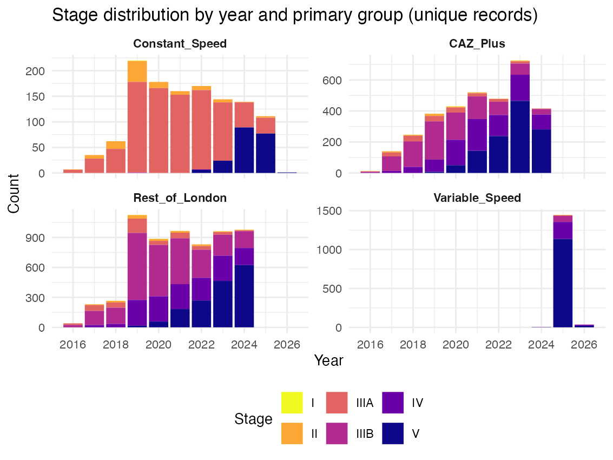
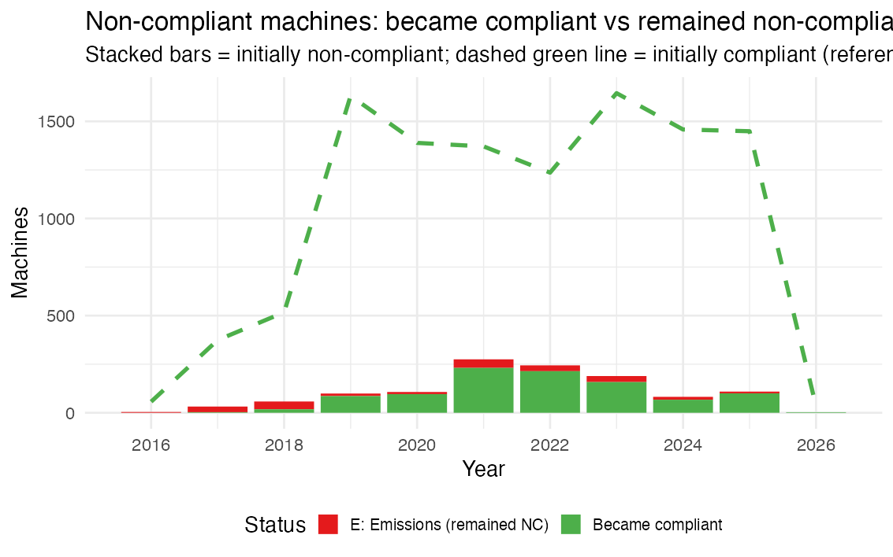
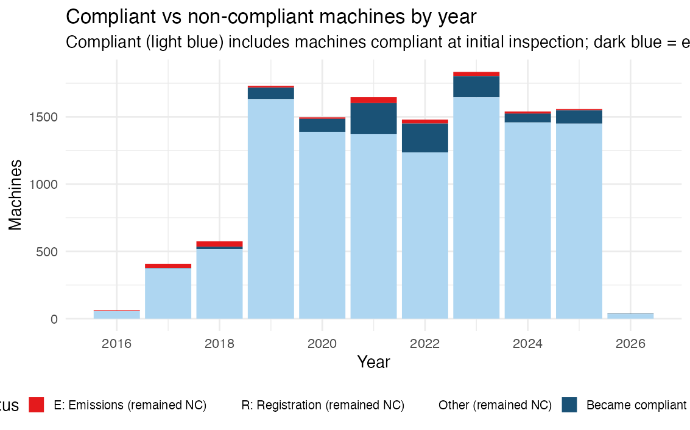
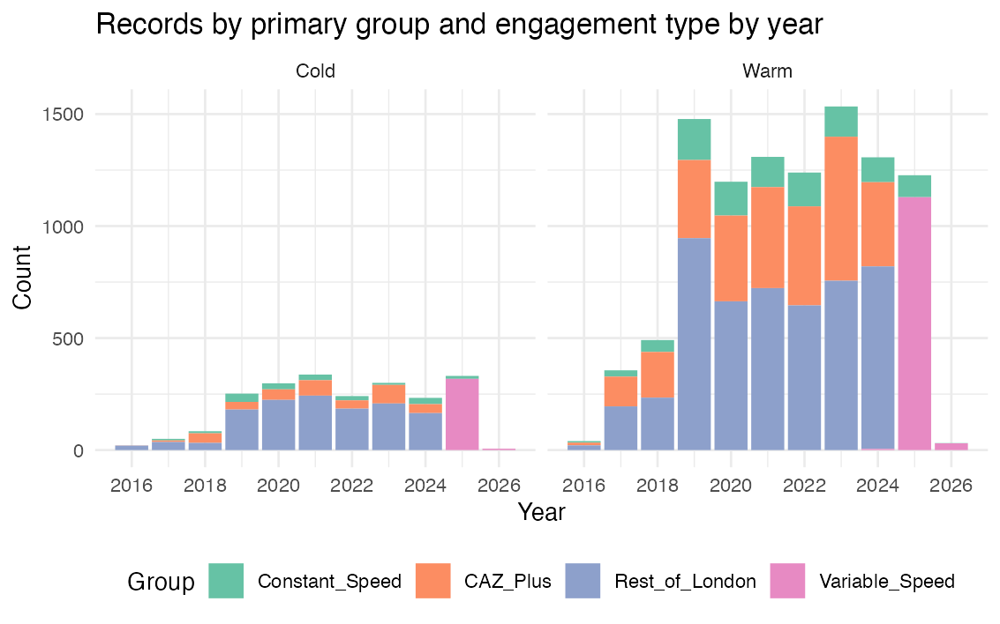

# Step 1 Outputs — 260422_step1_ingestion_v5

Generated: 2026-04-22 15:38:43

## Step 1.1–1.4 Record Counts

### Note on row structure

audits.rds contains **22011 rows** representing **12363 unique audit records** plus **9648 duplicate rows** for the Variable_Speed continuous series. Use `filter(group == group_primary)` to work with unique records only.

### Unique records by primary group × phase

<table class="table table-condensed" style="width: auto !important; margin-left: auto; margin-right: auto;">
<caption>Unique audit records by primary group × phase</caption>
 <thead>
<tr>
<th style="empty-cells: hide;border-bottom:hidden;" colspan="1"></th>
<th style="border-bottom:hidden;padding-bottom:0; padding-left:3px;padding-right:3px;text-align: center; " colspan="4">
Phase
</th>
<th style="empty-cells: hide;border-bottom:hidden;" colspan="1"></th>
</tr>
  <tr>
   <th style="text-align:left;"> group </th>
   <th style="text-align:right;"> A1 </th>
   <th style="text-align:right;"> A2 </th>
   <th style="text-align:right;"> B </th>
   <th style="text-align:right;"> C </th>
   <th style="text-align:right;"> Total </th>
  </tr>
 </thead>
<tbody>
  <tr>
   <td style="text-align:left;"> CAZ_Plus </td>
   <td style="text-align:right;"> 400 </td>
   <td style="text-align:right;"> 658 </td>
   <td style="text-align:right;"> 2296 </td>
   <td style="text-align:right;"> 0 </td>
   <td style="text-align:right;"> 3354 </td>
  </tr>
  <tr>
   <td style="text-align:left;"> Constant_Speed </td>
   <td style="text-align:right;"> 104 </td>
   <td style="text-align:right;"> 318 </td>
   <td style="text-align:right;"> 693 </td>
   <td style="text-align:right;"> 112 </td>
   <td style="text-align:right;"> 1227 </td>
  </tr>
  <tr>
   <td style="text-align:left;"> Rest_of_London </td>
   <td style="text-align:right;"> 538 </td>
   <td style="text-align:right;"> 1634 </td>
   <td style="text-align:right;"> 4122 </td>
   <td style="text-align:right;"> 0 </td>
   <td style="text-align:right;"> 6294 </td>
  </tr>
  <tr>
   <td style="text-align:left;"> Variable_Speed </td>
   <td style="text-align:right;"> 0 </td>
   <td style="text-align:right;"> 0 </td>
   <td style="text-align:right;"> 5 </td>
   <td style="text-align:right;"> 1483 </td>
   <td style="text-align:right;"> 1488 </td>
  </tr>
</tbody>
</table>

One row per unique audit record; group_primary is the 4-way zone assignment. NA_phase = pre-2016 or between-boundary records.
Rest_of_London dominates the record count; Variable_Speed (P24) records appear in Phase C only.

### Cold-engaged unique records by primary group × phase

<table class="table table-condensed" style="width: auto !important; margin-left: auto; margin-right: auto;">
<caption>Cold-engaged unique records by group × phase</caption>
 <thead>
<tr>
<th style="empty-cells: hide;border-bottom:hidden;" colspan="1"></th>
<th style="border-bottom:hidden;padding-bottom:0; padding-left:3px;padding-right:3px;text-align: center; " colspan="4">
Phase
</th>
<th style="empty-cells: hide;border-bottom:hidden;" colspan="1"></th>
</tr>
  <tr>
   <th style="text-align:left;"> group </th>
   <th style="text-align:right;"> A1 </th>
   <th style="text-align:right;"> A2 </th>
   <th style="text-align:right;"> B </th>
   <th style="text-align:right;"> C </th>
   <th style="text-align:right;"> Total </th>
  </tr>
 </thead>
<tbody>
  <tr>
   <td style="text-align:left;"> CAZ_Plus </td>
   <td style="text-align:right;"> 51 </td>
   <td style="text-align:right;"> 69 </td>
   <td style="text-align:right;"> 241 </td>
   <td style="text-align:right;"> 0 </td>
   <td style="text-align:right;"> 361 </td>
  </tr>
  <tr>
   <td style="text-align:left;"> Constant_Speed </td>
   <td style="text-align:right;"> 16 </td>
   <td style="text-align:right;"> 46 </td>
   <td style="text-align:right;"> 99 </td>
   <td style="text-align:right;"> 13 </td>
   <td style="text-align:right;"> 174 </td>
  </tr>
  <tr>
   <td style="text-align:left;"> Rest_of_London </td>
   <td style="text-align:right;"> 88 </td>
   <td style="text-align:right;"> 288 </td>
   <td style="text-align:right;"> 918 </td>
   <td style="text-align:right;"> 0 </td>
   <td style="text-align:right;"> 1294 </td>
  </tr>
  <tr>
   <td style="text-align:left;"> Variable_Speed </td>
   <td style="text-align:right;"> 0 </td>
   <td style="text-align:right;"> 0 </td>
   <td style="text-align:right;"> 0 </td>
   <td style="text-align:right;"> 324 </td>
   <td style="text-align:right;"> 324 </td>
  </tr>
</tbody>
</table>

Cold-engaged records used for λ_CF estimation; distribution mirrors all-records pattern at lower counts.
Constant_Speed cold sample is notably sparse relative to variable-engine groups.

### Warm-engaged unique records by primary group × phase

<table class="table table-condensed" style="width: auto !important; margin-left: auto; margin-right: auto;">
<caption>Warm-engaged unique records by group × phase</caption>
 <thead>
<tr>
<th style="empty-cells: hide;border-bottom:hidden;" colspan="1"></th>
<th style="border-bottom:hidden;padding-bottom:0; padding-left:3px;padding-right:3px;text-align: center; " colspan="4">
Phase
</th>
<th style="empty-cells: hide;border-bottom:hidden;" colspan="1"></th>
</tr>
  <tr>
   <th style="text-align:left;"> group </th>
   <th style="text-align:right;"> A1 </th>
   <th style="text-align:right;"> A2 </th>
   <th style="text-align:right;"> B </th>
   <th style="text-align:right;"> C </th>
   <th style="text-align:right;"> Total </th>
  </tr>
 </thead>
<tbody>
  <tr>
   <td style="text-align:left;"> CAZ_Plus </td>
   <td style="text-align:right;"> 349 </td>
   <td style="text-align:right;"> 589 </td>
   <td style="text-align:right;"> 2055 </td>
   <td style="text-align:right;"> 0 </td>
   <td style="text-align:right;"> 2993 </td>
  </tr>
  <tr>
   <td style="text-align:left;"> Constant_Speed </td>
   <td style="text-align:right;"> 88 </td>
   <td style="text-align:right;"> 272 </td>
   <td style="text-align:right;"> 594 </td>
   <td style="text-align:right;"> 99 </td>
   <td style="text-align:right;"> 1053 </td>
  </tr>
  <tr>
   <td style="text-align:left;"> Rest_of_London </td>
   <td style="text-align:right;"> 450 </td>
   <td style="text-align:right;"> 1346 </td>
   <td style="text-align:right;"> 3204 </td>
   <td style="text-align:right;"> 0 </td>
   <td style="text-align:right;"> 5000 </td>
  </tr>
  <tr>
   <td style="text-align:left;"> Variable_Speed </td>
   <td style="text-align:right;"> 0 </td>
   <td style="text-align:right;"> 0 </td>
   <td style="text-align:right;"> 5 </td>
   <td style="text-align:right;"> 1159 </td>
   <td style="text-align:right;"> 1164 </td>
  </tr>
</tbody>
</table>

Warm records used for λ_Proactive estimation (self-compliant warm subset).
Warm counts mirror the all-records distribution; no systematic engagement-type bias by phase.

### Expanded record counts (includes Variable_Speed continuous rows)

<table class="table table-condensed" style="width: auto !important; margin-left: auto; margin-right: auto;">
<caption>Expanded audits row counts by group × phase</caption>
 <thead>
<tr>
<th style="empty-cells: hide;border-bottom:hidden;" colspan="1"></th>
<th style="border-bottom:hidden;padding-bottom:0; padding-left:3px;padding-right:3px;text-align: center; " colspan="4">
Phase
</th>
<th style="empty-cells: hide;border-bottom:hidden;" colspan="1"></th>
</tr>
  <tr>
   <th style="text-align:left;"> group </th>
   <th style="text-align:right;"> A1 </th>
   <th style="text-align:right;"> A2 </th>
   <th style="text-align:right;"> B </th>
   <th style="text-align:right;"> C </th>
   <th style="text-align:right;"> Total </th>
  </tr>
 </thead>
<tbody>
  <tr>
   <td style="text-align:left;"> CAZ_Plus </td>
   <td style="text-align:right;"> 400 </td>
   <td style="text-align:right;"> 658 </td>
   <td style="text-align:right;"> 2296 </td>
   <td style="text-align:right;"> 0 </td>
   <td style="text-align:right;"> 3354 </td>
  </tr>
  <tr>
   <td style="text-align:left;"> Constant_Speed </td>
   <td style="text-align:right;"> 104 </td>
   <td style="text-align:right;"> 318 </td>
   <td style="text-align:right;"> 693 </td>
   <td style="text-align:right;"> 112 </td>
   <td style="text-align:right;"> 1227 </td>
  </tr>
  <tr>
   <td style="text-align:left;"> Rest_of_London </td>
   <td style="text-align:right;"> 538 </td>
   <td style="text-align:right;"> 1634 </td>
   <td style="text-align:right;"> 4122 </td>
   <td style="text-align:right;"> 0 </td>
   <td style="text-align:right;"> 6294 </td>
  </tr>
  <tr>
   <td style="text-align:left;"> Variable_Speed </td>
   <td style="text-align:right;"> 938 </td>
   <td style="text-align:right;"> 2292 </td>
   <td style="text-align:right;"> 6423 </td>
   <td style="text-align:right;"> 1483 </td>
   <td style="text-align:right;"> 11136 </td>
  </tr>
</tbody>
</table>

Variable_Speed row shows all variable-engine records across A1–C, enabling continuous trend analysis.
CAZ_Plus and Rest_of_London total within each phase equals their contribution to Variable_Speed.

## Step 1.4 Checksum Analysis

<table class="table table-condensed" style="width: auto !important; margin-left: auto; margin-right: auto;">
<caption>Exclusion pipeline and row counts</caption>
 <thead>
  <tr>
   <th style="text-align:left;"> stage </th>
   <th style="text-align:right;"> n </th>
  </tr>
 </thead>
<tbody>
  <tr>
   <td style="text-align:left;"> Raw records imported </td>
   <td style="text-align:right;"> 16251 </td>
  </tr>
  <tr>
   <td style="text-align:left;"> Excluded — No NRMM / non-machinery </td>
   <td style="text-align:right;"> 2710 </td>
  </tr>
  <tr>
   <td style="text-align:left;"> Excluded — Zone out of scope </td>
   <td style="text-align:right;"> 0 </td>
  </tr>
  <tr>
   <td style="text-align:left;"> Excluded — Engine type unassignable </td>
   <td style="text-align:right;"> 449 </td>
  </tr>
  <tr>
   <td style="text-align:left;"> Excluded — Initial stage unresolvable </td>
   <td style="text-align:right;"> 537 </td>
  </tr>
  <tr>
   <td style="text-align:left;"> Excluded — COVID exempt </td>
   <td style="text-align:right;"> 192 </td>
  </tr>
  <tr>
   <td style="text-align:left;"> Total excluded </td>
   <td style="text-align:right;"> 3888 </td>
  </tr>
  <tr>
   <td style="text-align:left;"> Unique records retained </td>
   <td style="text-align:right;"> 12363 </td>
  </tr>
  <tr>
   <td style="text-align:left;"> VS duplicate rows added </td>
   <td style="text-align:right;"> 9648 </td>
  </tr>
  <tr>
   <td style="text-align:left;"> Total rows in audits.rds </td>
   <td style="text-align:right;"> 22011 </td>
  </tr>
</tbody>
</table>

<table class="table table-condensed" style="width: auto !important; margin-left: auto; margin-right: auto;">
<caption>Checksum verification — Step 1.4</caption>
 <thead>
  <tr>
   <th style="text-align:left;"> check </th>
   <th style="text-align:right;"> lhs </th>
   <th style="text-align:right;"> rhs </th>
   <th style="text-align:left;"> result </th>
  </tr>
 </thead>
<tbody>
  <tr>
   <td style="text-align:left;"> raw = unique_retained + total_excluded </td>
   <td style="text-align:right;"> 16251 </td>
   <td style="text-align:right;"> 16251 </td>
   <td style="text-align:left;"> PASS </td>
  </tr>
  <tr>
   <td style="text-align:left;"> sum(primary group counts) = n_unique_records </td>
   <td style="text-align:right;"> 12363 </td>
   <td style="text-align:right;"> 12363 </td>
   <td style="text-align:left;"> PASS </td>
  </tr>
  <tr>
   <td style="text-align:left;"> VS rows = CAZ_Plus + RoL + P24_VS (unique) </td>
   <td style="text-align:right;"> 11136 </td>
   <td style="text-align:right;"> 11136 </td>
   <td style="text-align:left;"> PASS </td>
  </tr>
  <tr>
   <td style="text-align:left;"> cold + warm = n_unique_records </td>
   <td style="text-align:right;"> 12363 </td>
   <td style="text-align:right;"> 12363 </td>
   <td style="text-align:left;"> PASS </td>
  </tr>
  <tr>
   <td style="text-align:left;"> no NA group_primary values </td>
   <td style="text-align:right;"> 0 </td>
   <td style="text-align:right;"> 0 </td>
   <td style="text-align:left;"> PASS </td>
  </tr>
</tbody>
</table>

PASS on all rows confirms: pipeline exclusions are complete; group_primary assigns every unique record.

## Logic-Bug Audit — Pipeline Assignment Tasks

Systematic check of all pipeline-derived flags against actual raw field values.

### A. cold_engaged

**Derivation:** `toupper(trimws(cold_engaged)) %in% c('YES', 'Y', 'V')`
<table class="table table-condensed" style="width: auto !important; margin-left: auto; margin-right: auto;">
<caption>Raw values in Cold.Engaged field</caption>
 <thead>
  <tr>
   <th style="text-align:left;"> v </th>
   <th style="text-align:right;"> n </th>
  </tr>
 </thead>
<tbody>
  <tr>
   <td style="text-align:left;"> No </td>
   <td style="text-align:right;"> 12293 </td>
  </tr>
  <tr>
   <td style="text-align:left;"> Yes </td>
   <td style="text-align:right;"> 3935 </td>
  </tr>
  <tr>
   <td style="text-align:left;"> yes </td>
   <td style="text-align:right;"> 23 </td>
  </tr>
</tbody>
</table>

**Correctness:** 'Yes' → TRUE; 'No' → FALSE; NA → FALSE (not in set — treated as warm, conservative).
**NA / blank values:** 0 — treated as warm.
**Bugs found:** None. Standard Yes/No handled correctly.

### B. init_mach_emissions_compliant / init_mach_admin_compliant

**v4 derivation (buggy):** `r <- toupper(trimws(reasons)); !grepl('E', r, fixed=TRUE)`
**v4 bug:** `toupper('None') = 'NONE'`; `grepl('E', 'NONE', fixed=TRUE) = TRUE` → machines with reasons='None' were incorrectly flagged as E non-compliant.
**v5 fix:** Removed `toupper()` before fixed=TRUE check. `grepl('E', 'None', fixed=TRUE) = FALSE` (lowercase 'e' ≠ uppercase 'E' code). NC codes are uppercase single letters by schema convention.
<table class="table table-condensed" style="width: auto !important; margin-left: auto; margin-right: auto;">
<caption>Top 25 raw values in Initial.Machinery.Reasons (in-scope records)</caption>
 <thead>
  <tr>
   <th style="text-align:left;"> v </th>
   <th style="text-align:right;"> n </th>
  </tr>
 </thead>
<tbody>
  <tr>
   <td style="text-align:left;"> None </td>
   <td style="text-align:right;"> 8011 </td>
  </tr>
  <tr>
   <td style="text-align:left;"> R </td>
   <td style="text-align:right;"> 3274 </td>
  </tr>
  <tr>
   <td style="text-align:left;"> ER </td>
   <td style="text-align:right;"> 925 </td>
  </tr>
  <tr>
   <td style="text-align:left;"> CR </td>
   <td style="text-align:right;"> 550 </td>
  </tr>
  <tr>
   <td style="text-align:left;"> E </td>
   <td style="text-align:right;"> 382 </td>
  </tr>
  <tr>
   <td style="text-align:left;"> C </td>
   <td style="text-align:right;"> 377 </td>
  </tr>
  <tr>
   <td style="text-align:left;"> CE </td>
   <td style="text-align:right;"> 6 </td>
  </tr>
  <tr>
   <td style="text-align:left;"> none </td>
   <td style="text-align:right;"> 6 </td>
  </tr>
  <tr>
   <td style="text-align:left;">  </td>
   <td style="text-align:right;"> 5 </td>
  </tr>
  <tr>
   <td style="text-align:left;"> A </td>
   <td style="text-align:right;"> 2 </td>
  </tr>
  <tr>
   <td style="text-align:left;"> CER </td>
   <td style="text-align:right;"> 2 </td>
  </tr>
  <tr>
   <td style="text-align:left;"> Unidentified </td>
   <td style="text-align:right;"> 1 </td>
  </tr>
</tbody>
</table>

**Correctness (v5):** 'None' → emissions_compliant=TRUE (correct); 'E'/'ER'/'EP' → FALSE; '' → TRUE; NA → TRUE.
**'None' records in retained data:** 7856 | **init_mach_emissions_compliant FALSE:** 1202

### C. initial_stage / final_stage (encode_stage)

**Derivation:** `encode_stage()` maps to STAGE_MAP integers 1–7; handles known typos.
<table class="table table-condensed" style="width: auto !important; margin-left: auto; margin-right: auto;">
<caption>Raw values in Initial.Emissions.Stage (all records)</caption>
 <thead>
  <tr>
   <th style="text-align:left;"> v </th>
   <th style="text-align:right;"> n </th>
  </tr>
 </thead>
<tbody>
  <tr>
   <td style="text-align:left;"> V </td>
   <td style="text-align:right;"> 4545 </td>
  </tr>
  <tr>
   <td style="text-align:left;"> IIIB </td>
   <td style="text-align:right;"> 3910 </td>
  </tr>
  <tr>
   <td style="text-align:left;"> IV </td>
   <td style="text-align:right;"> 2620 </td>
  </tr>
  <tr>
   <td style="text-align:left;"> IIIA </td>
   <td style="text-align:right;"> 1749 </td>
  </tr>
  <tr>
   <td style="text-align:left;"> Unidentified </td>
   <td style="text-align:right;"> 1045 </td>
  </tr>
  <tr>
   <td style="text-align:left;"> No NRMM </td>
   <td style="text-align:right;"> 856 </td>
  </tr>
  <tr>
   <td style="text-align:left;"> Site Complete </td>
   <td style="text-align:right;"> 783 </td>
  </tr>
  <tr>
   <td style="text-align:left;"> II </td>
   <td style="text-align:right;"> 304 </td>
  </tr>
  <tr>
   <td style="text-align:left;"> Inappropriate for Audit </td>
   <td style="text-align:right;"> 129 </td>
  </tr>
  <tr>
   <td style="text-align:left;">  </td>
   <td style="text-align:right;"> 128 </td>
  </tr>
  <tr>
   <td style="text-align:left;"> No Apparent Works </td>
   <td style="text-align:right;"> 92 </td>
  </tr>
  <tr>
   <td style="text-align:left;"> Electric </td>
   <td style="text-align:right;"> 31 </td>
  </tr>
  <tr>
   <td style="text-align:left;"> Uncertified </td>
   <td style="text-align:right;"> 25 </td>
  </tr>
  <tr>
   <td style="text-align:left;"> I </td>
   <td style="text-align:right;"> 23 </td>
  </tr>
  <tr>
   <td style="text-align:left;"> DECLINED AUDIT </td>
   <td style="text-align:right;"> 7 </td>
  </tr>
  <tr>
   <td style="text-align:left;"> Inappropriate for audit </td>
   <td style="text-align:right;"> 2 </td>
  </tr>
  <tr>
   <td style="text-align:left;"> Site complete </td>
   <td style="text-align:right;"> 1 </td>
  </tr>
  <tr>
   <td style="text-align:left;"> iIIB </td>
   <td style="text-align:right;"> 1 </td>
  </tr>
</tbody>
</table>

**Typo corrections applied:** 'iIIB' → 'IIIB'; 'iV' → 'IV'.
**ZE/hybrid/other mapping:** regex `^ZE$|zero.emission|hybrid` (ignore.case) → 7.
**Unresolvable after fixup:** 3099 (excluded in step 3d).
**Correctness:** All standard stage strings and known typos handled; remaining NA excluded.

### D. zone classification

**Derivation:** retain rows where `zone %in% c('CAZ', 'OA', 'GL', 'P24')`; exclude BCP/other.
<table class="table table-condensed" style="width: auto !important; margin-left: auto; margin-right: auto;">
<caption>Raw values in Zone field (all records)</caption>
 <thead>
  <tr>
   <th style="text-align:left;"> v </th>
   <th style="text-align:right;"> n </th>
  </tr>
 </thead>
<tbody>
  <tr>
   <td style="text-align:left;"> GL </td>
   <td style="text-align:right;"> 8792 </td>
  </tr>
  <tr>
   <td style="text-align:left;"> OA </td>
   <td style="text-align:right;"> 2553 </td>
  </tr>
  <tr>
   <td style="text-align:left;"> P24 </td>
   <td style="text-align:right;"> 2134 </td>
  </tr>
  <tr>
   <td style="text-align:left;"> CAZ </td>
   <td style="text-align:right;"> 2064 </td>
  </tr>
  <tr>
   <td style="text-align:left;"> BCP </td>
   <td style="text-align:right;"> 708 </td>
  </tr>
</tbody>
</table>

**Correctness:** trimws() applied before comparison. All expected in-scope zone codes present.
**Unexpected zone values:** None found.
**Bugs found:** None.

### E. group_primary (case_when)

**Derivation:** `case_when(engine_type_clean + zone → group)`
<table class="table table-condensed" style="width: auto !important; margin-left: auto; margin-right: auto;">
<caption>group_primary distribution (unique retained records)</caption>
 <thead>
  <tr>
   <th style="text-align:left;"> group_primary </th>
   <th style="text-align:right;"> n </th>
  </tr>
 </thead>
<tbody>
  <tr>
   <td style="text-align:left;"> Constant_Speed </td>
   <td style="text-align:right;"> 1227 </td>
  </tr>
  <tr>
   <td style="text-align:left;"> CAZ_Plus </td>
   <td style="text-align:right;"> 3354 </td>
  </tr>
  <tr>
   <td style="text-align:left;"> Rest_of_London </td>
   <td style="text-align:right;"> 6294 </td>
  </tr>
  <tr>
   <td style="text-align:left;"> Variable_Speed </td>
   <td style="text-align:right;"> 1488 </td>
  </tr>
</tbody>
</table>

**NA group_primary values:** 0 — all records assigned.
**Correctness:** case_when TRUE arm catches any residual — produces NA which triggers FLAG block above.
**Bugs found:** None.

### F. phase assignment (assign_phase)

**Derivation:** `case_when` on date boundaries A1/A2/B/C; records outside all boundaries → NA.
<table class="table table-condensed" style="width: auto !important; margin-left: auto; margin-right: auto;">
<caption>Phase distribution (unique retained records)</caption>
 <thead>
  <tr>
   <th style="text-align:left;"> phase_label </th>
   <th style="text-align:right;"> n </th>
  </tr>
 </thead>
<tbody>
  <tr>
   <td style="text-align:left;"> A1 </td>
   <td style="text-align:right;"> 1042 </td>
  </tr>
  <tr>
   <td style="text-align:left;"> A2 </td>
   <td style="text-align:right;"> 2610 </td>
  </tr>
  <tr>
   <td style="text-align:left;"> B </td>
   <td style="text-align:right;"> 7116 </td>
  </tr>
  <tr>
   <td style="text-align:left;"> C </td>
   <td style="text-align:right;"> 1595 </td>
  </tr>
</tbody>
</table>

**Boundary gaps:** check between A2_END (31.8.2020) and B_START (1.9.2020): no gap. A1_END (31.12.2018) and A2_START (1.1.2019): no gap.
**Records between A1 and A2:** 0 | **Between A2 and B:** 0
**Bugs found:** None. Boundaries are contiguous; no gap records.

### G. no_power_rating

**Derivation:** TRUE when kw_power_raw is blank, 'UNIDENTIFIED' (case-insensitive), or not numeric.
<table class="table table-condensed" style="width: auto !important; margin-left: auto; margin-right: auto;">
<caption>Top values triggering no_power_rating=TRUE</caption>
 <thead>
  <tr>
   <th style="text-align:left;"> v </th>
   <th style="text-align:right;"> n </th>
  </tr>
 </thead>
<tbody>
  <tr>
   <td style="text-align:left;"> Unidentified </td>
   <td style="text-align:right;"> 269 </td>
  </tr>
  <tr>
   <td style="text-align:left;">  </td>
   <td style="text-align:right;"> 110 </td>
  </tr>
  <tr>
   <td style="text-align:left;"> 130-560 </td>
   <td style="text-align:right;"> 13 </td>
  </tr>
  <tr>
   <td style="text-align:left;"> 37-56 </td>
   <td style="text-align:right;"> 11 </td>
  </tr>
  <tr>
   <td style="text-align:left;"> 37-75 </td>
   <td style="text-align:right;"> 7 </td>
  </tr>
  <tr>
   <td style="text-align:left;"> 56-130 </td>
   <td style="text-align:right;"> 4 </td>
  </tr>
  <tr>
   <td style="text-align:left;"> tbc </td>
   <td style="text-align:right;"> 2 </td>
  </tr>
  <tr>
   <td style="text-align:left;"> - </td>
   <td style="text-align:right;"> 1 </td>
  </tr>
  <tr>
   <td style="text-align:left;"> 225-450 </td>
   <td style="text-align:right;"> 1 </td>
  </tr>
  <tr>
   <td style="text-align:left;"> 32-40 </td>
   <td style="text-align:right;"> 1 </td>
  </tr>
  <tr>
   <td style="text-align:left;"> 75-130 </td>
   <td style="text-align:right;"> 1 </td>
  </tr>
  <tr>
   <td style="text-align:left;"> &gt;130 </td>
   <td style="text-align:right;"> 1 </td>
  </tr>
  <tr>
   <td style="text-align:left;"> n/k </td>
   <td style="text-align:right;"> 1 </td>
  </tr>
</tbody>
</table>

**Total flagged:** 422 of 12363 retained records.
**Correctness:** `toupper(trimws(kw_power_raw)) == 'UNIDENTIFIED'` handles case variation.
**Bugs found:** None. Flag only; records are retained.

### H. engine_type_clean

**Derivation:** Generator-family machine_types override to 'Constant'; blank engine_type → 'Variable'.
<table class="table table-condensed" style="width: auto !important; margin-left: auto; margin-right: auto;">
<caption>Raw Engine.Type values (in-scope, in-scope compliance records)</caption>
 <thead>
  <tr>
   <th style="text-align:left;"> v </th>
   <th style="text-align:right;"> n </th>
  </tr>
 </thead>
<tbody>
  <tr>
   <td style="text-align:left;"> Variable </td>
   <td style="text-align:right;"> 10719 </td>
  </tr>
  <tr>
   <td style="text-align:left;">  </td>
   <td style="text-align:right;"> 1479 </td>
  </tr>
  <tr>
   <td style="text-align:left;"> Constant </td>
   <td style="text-align:right;"> 726 </td>
  </tr>
  <tr>
   <td style="text-align:left;"> Unidentified </td>
   <td style="text-align:right;"> 602 </td>
  </tr>
  <tr>
   <td style="text-align:left;"> Electric </td>
   <td style="text-align:right;"> 5 </td>
  </tr>
  <tr>
   <td style="text-align:left;"> Uncertified </td>
   <td style="text-align:right;"> 4 </td>
  </tr>
  <tr>
   <td style="text-align:left;"> NA </td>
   <td style="text-align:right;"> 3 </td>
  </tr>
  <tr>
   <td style="text-align:left;"> Not applicable </td>
   <td style="text-align:right;"> 2 </td>
  </tr>
  <tr>
   <td style="text-align:left;"> [Not Specified] </td>
   <td style="text-align:right;"> 1 </td>
  </tr>
</tbody>
</table>

**Generator-family overrides applied:** 735
**Blank engine_type set to Variable:** 1219
**Correctness:** `trimws(engine_type_clean) == ''` guard catches blanks after override. Residual non-Constant/Variable values excluded in step 3c.
**Bugs found:** None.

### Summary

<table class="table table-condensed" style="width: auto !important; margin-left: auto; margin-right: auto;">
<caption>Logic-bug audit summary</caption>
 <thead>
  <tr>
   <th style="text-align:left;"> field </th>
   <th style="text-align:left;"> bug_in_v4 </th>
   <th style="text-align:left;"> fix_in_v5 </th>
   <th style="text-align:left;"> status </th>
  </tr>
 </thead>
<tbody>
  <tr>
   <td style="text-align:left;"> cold_engaged </td>
   <td style="text-align:left;"> None </td>
   <td style="text-align:left;"> — </td>
   <td style="text-align:left;"> OK </td>
  </tr>
  <tr>
   <td style="text-align:left;"> init_mach_emissions_compliant </td>
   <td style="text-align:left;"> YES — toupper before fixed=TRUE: 'None'→'NONE' matched 'E' </td>
   <td style="text-align:left;"> Removed toupper() before grepl fixed=TRUE; NC codes are uppercase by convention </td>
   <td style="text-align:left;"> FIXED </td>
  </tr>
  <tr>
   <td style="text-align:left;"> init_mach_admin_compliant </td>
   <td style="text-align:left;"> None </td>
   <td style="text-align:left;"> — </td>
   <td style="text-align:left;"> OK </td>
  </tr>
  <tr>
   <td style="text-align:left;"> initial_stage / final_stage </td>
   <td style="text-align:left;"> None </td>
   <td style="text-align:left;"> — </td>
   <td style="text-align:left;"> OK </td>
  </tr>
  <tr>
   <td style="text-align:left;"> zone </td>
   <td style="text-align:left;"> None </td>
   <td style="text-align:left;"> — </td>
   <td style="text-align:left;"> OK </td>
  </tr>
  <tr>
   <td style="text-align:left;"> group_primary </td>
   <td style="text-align:left;"> None </td>
   <td style="text-align:left;"> — </td>
   <td style="text-align:left;"> OK </td>
  </tr>
  <tr>
   <td style="text-align:left;"> phase </td>
   <td style="text-align:left;"> None </td>
   <td style="text-align:left;"> — </td>
   <td style="text-align:left;"> OK </td>
  </tr>
  <tr>
   <td style="text-align:left;"> no_power_rating </td>
   <td style="text-align:left;"> None </td>
   <td style="text-align:left;"> — </td>
   <td style="text-align:left;"> OK </td>
  </tr>
  <tr>
   <td style="text-align:left;"> engine_type_clean </td>
   <td style="text-align:left;"> None </td>
   <td style="text-align:left;"> — </td>
   <td style="text-align:left;"> OK </td>
  </tr>
</tbody>
</table>

One bug found and fixed: derive_compliance_flags() incorrectly uppercased the reason string before the case-sensitive E-code check.
All other pipeline assignment tasks correctly handle 'None', NA, mixed case, and empty strings.

## Step 1.5 Statistics and Charts

### 8a. Excluded records by year and reason

<table class="table table-condensed" style="width: auto !important; margin-left: auto; margin-right: auto;">
<caption>Excluded records by year and exclusion reason</caption>
 <thead>
  <tr>
   <th style="text-align:right;"> year </th>
   <th style="text-align:right;"> Initial stage unresolvable </th>
   <th style="text-align:right;"> No NRMM / non-machinery </th>
   <th style="text-align:right;"> Engine type unassignable </th>
   <th style="text-align:right;"> COVID exempt </th>
  </tr>
 </thead>
<tbody>
  <tr>
   <td style="text-align:right;"> 2016 </td>
   <td style="text-align:right;"> 17 </td>
   <td style="text-align:right;"> 30 </td>
   <td style="text-align:right;"> 0 </td>
   <td style="text-align:right;"> 0 </td>
  </tr>
  <tr>
   <td style="text-align:right;"> 2017 </td>
   <td style="text-align:right;"> 70 </td>
   <td style="text-align:right;"> 76 </td>
   <td style="text-align:right;"> 0 </td>
   <td style="text-align:right;"> 0 </td>
  </tr>
  <tr>
   <td style="text-align:right;"> 2018 </td>
   <td style="text-align:right;"> 102 </td>
   <td style="text-align:right;"> 53 </td>
   <td style="text-align:right;"> 0 </td>
   <td style="text-align:right;"> 0 </td>
  </tr>
  <tr>
   <td style="text-align:right;"> 2019 </td>
   <td style="text-align:right;"> 75 </td>
   <td style="text-align:right;"> 90 </td>
   <td style="text-align:right;"> 108 </td>
   <td style="text-align:right;"> 0 </td>
  </tr>
  <tr>
   <td style="text-align:right;"> 2020 </td>
   <td style="text-align:right;"> 27 </td>
   <td style="text-align:right;"> 395 </td>
   <td style="text-align:right;"> 84 </td>
   <td style="text-align:right;"> 166 </td>
  </tr>
  <tr>
   <td style="text-align:right;"> 2021 </td>
   <td style="text-align:right;"> 46 </td>
   <td style="text-align:right;"> 409 </td>
   <td style="text-align:right;"> 74 </td>
   <td style="text-align:right;"> 26 </td>
  </tr>
  <tr>
   <td style="text-align:right;"> 2022 </td>
   <td style="text-align:right;"> 50 </td>
   <td style="text-align:right;"> 177 </td>
   <td style="text-align:right;"> 60 </td>
   <td style="text-align:right;"> 0 </td>
  </tr>
  <tr>
   <td style="text-align:right;"> 2023 </td>
   <td style="text-align:right;"> 43 </td>
   <td style="text-align:right;"> 150 </td>
   <td style="text-align:right;"> 61 </td>
   <td style="text-align:right;"> 0 </td>
  </tr>
  <tr>
   <td style="text-align:right;"> 2024 </td>
   <td style="text-align:right;"> 72 </td>
   <td style="text-align:right;"> 399 </td>
   <td style="text-align:right;"> 41 </td>
   <td style="text-align:right;"> 0 </td>
  </tr>
  <tr>
   <td style="text-align:right;"> 2025 </td>
   <td style="text-align:right;"> 34 </td>
   <td style="text-align:right;"> 927 </td>
   <td style="text-align:right;"> 21 </td>
   <td style="text-align:right;"> 0 </td>
  </tr>
  <tr>
   <td style="text-align:right;"> 2026 </td>
   <td style="text-align:right;"> 1 </td>
   <td style="text-align:right;"> 4 </td>
   <td style="text-align:right;"> 0 </td>
   <td style="text-align:right;"> 0 </td>
  </tr>
</tbody>
</table>

Exclusion volume peaks in the Phase B window (2020–2024) driven by COVID exemptions and sustained BCP zone activity.
Non-machinery and stage-unresolvable exclusions are distributed across the full time series.

### 8b. Stage distribution by year — unique records

Stage distribution shifts from predominantly Stages II–IIIB in 2016 towards Stages IV–V from 2020 onwards.
Stage V becomes dominant by 2022–2023, reflecting progressive policy-driven fleet improvement.

Constant_Speed transitions sharply to Stage V from 2022; CAZ_Plus and Rest_of_London show a more gradual shift.
Variable_Speed (P24, Phase C) enters predominantly at Stage V, consistent with anticipatory pre-2025 compliance.

### 8c. Non-compliance codes vs compliant machines by year

<table class="table table-condensed" style="width: auto !important; margin-left: auto; margin-right: auto;">
<caption>Compliance status by year — pre-derived boolean flags</caption>
 <thead>
  <tr>
   <th style="text-align:right;"> year </th>
   <th style="text-align:right;"> E: Emissions (remained NC) </th>
   <th style="text-align:right;"> Compliant </th>
   <th style="text-align:right;"> Became compliant </th>
   <th style="text-align:right;"> Total </th>
  </tr>
 </thead>
<tbody>
  <tr>
   <td style="text-align:right;"> 2016 </td>
   <td style="text-align:right;"> 4 </td>
   <td style="text-align:right;"> 57 </td>
   <td style="text-align:right;"> 0 </td>
   <td style="text-align:right;"> 2077 </td>
  </tr>
  <tr>
   <td style="text-align:right;"> 2017 </td>
   <td style="text-align:right;"> 29 </td>
   <td style="text-align:right;"> 374 </td>
   <td style="text-align:right;"> 3 </td>
   <td style="text-align:right;"> 2423 </td>
  </tr>
  <tr>
   <td style="text-align:right;"> 2018 </td>
   <td style="text-align:right;"> 40 </td>
   <td style="text-align:right;"> 517 </td>
   <td style="text-align:right;"> 18 </td>
   <td style="text-align:right;"> 2593 </td>
  </tr>
  <tr>
   <td style="text-align:right;"> 2019 </td>
   <td style="text-align:right;"> 13 </td>
   <td style="text-align:right;"> 1631 </td>
   <td style="text-align:right;"> 86 </td>
   <td style="text-align:right;"> 3749 </td>
  </tr>
  <tr>
   <td style="text-align:right;"> 2020 </td>
   <td style="text-align:right;"> 11 </td>
   <td style="text-align:right;"> 1389 </td>
   <td style="text-align:right;"> 96 </td>
   <td style="text-align:right;"> 3516 </td>
  </tr>
  <tr>
   <td style="text-align:right;"> 2021 </td>
   <td style="text-align:right;"> 44 </td>
   <td style="text-align:right;"> 1371 </td>
   <td style="text-align:right;"> 231 </td>
   <td style="text-align:right;"> 3667 </td>
  </tr>
  <tr>
   <td style="text-align:right;"> 2022 </td>
   <td style="text-align:right;"> 30 </td>
   <td style="text-align:right;"> 1236 </td>
   <td style="text-align:right;"> 214 </td>
   <td style="text-align:right;"> 3502 </td>
  </tr>
  <tr>
   <td style="text-align:right;"> 2023 </td>
   <td style="text-align:right;"> 31 </td>
   <td style="text-align:right;"> 1645 </td>
   <td style="text-align:right;"> 158 </td>
   <td style="text-align:right;"> 3857 </td>
  </tr>
  <tr>
   <td style="text-align:right;"> 2024 </td>
   <td style="text-align:right;"> 15 </td>
   <td style="text-align:right;"> 1458 </td>
   <td style="text-align:right;"> 67 </td>
   <td style="text-align:right;"> 3564 </td>
  </tr>
  <tr>
   <td style="text-align:right;"> 2025 </td>
   <td style="text-align:right;"> 9 </td>
   <td style="text-align:right;"> 1449 </td>
   <td style="text-align:right;"> 100 </td>
   <td style="text-align:right;"> 3583 </td>
  </tr>
  <tr>
   <td style="text-align:right;"> 2026 </td>
   <td style="text-align:right;"> 0 </td>
   <td style="text-align:right;"> 34 </td>
   <td style="text-align:right;"> 3 </td>
   <td style="text-align:right;"> 2063 </td>
  </tr>
</tbody>
</table>

Each machine counted once using init_mach_emissions_compliant (pre-derived, fixed=TRUE, no toupper).
'Became compliant' = machines non-compliant at initial inspection but compliant at final assessment; directly measures enforcement-driven compliance uplift.

Emissions non-compliance (E: Emissions, remained NC) dominates the non-compliant pool; 'Became compliant' shows the enforcement-driven uplift each year.
Dashed green reference line shows the far larger compliant pool, providing scale context for the non-compliant bars.

The compliant pool (light blue + dark blue) grows over time as the fleet improves; the emissions non-compliant segment (red) shrinks.
'Became compliant' (dark blue) is the enforcement-attributable fraction — machines that changed status between initial and final inspection.

### 8d. Primary group and engagement type by year (unique records)

Rest_of_London dominates both cold and warm counts across all years; Constant_Speed is stable.
Variable_Speed (P24) appears from 2025 only in the primary-group view.

### 8e. Variable_Speed continuous by year — all variable-engine records

Variable_Speed is a continuous series from 2016 through 2026: CAZ_Plus and Rest_of_London records contribute through Phase B; Variable_Speed (P24) takes over in Phase C.
CAZ_Plus and Rest_of_London are discontinued from 1.1.2025 because no new CAZ/OA/GL records exist after that date.

### 8f. Pre-2016 records (retained, NA phase)

No pre-2016 records in retained dataset.

## Step 1.6 Formal Checksum Verification

<table class="table table-condensed" style="width: auto !important; margin-left: auto; margin-right: auto;">
<caption>Full accounting: raw = unique_retained + excluded</caption>
 <thead>
  <tr>
   <th style="text-align:left;"> item </th>
   <th style="text-align:right;"> count </th>
   <th style="text-align:left;"> status </th>
  </tr>
 </thead>
<tbody>
  <tr>
   <td style="text-align:left;"> Raw records imported </td>
   <td style="text-align:right;"> 16251 </td>
   <td style="text-align:left;">  </td>
  </tr>
  <tr>
   <td style="text-align:left;"> Excluded — No NRMM / non-machinery </td>
   <td style="text-align:right;"> 2710 </td>
   <td style="text-align:left;">  </td>
  </tr>
  <tr>
   <td style="text-align:left;"> Excluded — Zone out of scope (BCP/other) </td>
   <td style="text-align:right;"> 0 </td>
   <td style="text-align:left;">  </td>
  </tr>
  <tr>
   <td style="text-align:left;"> Excluded — Engine type unassignable </td>
   <td style="text-align:right;"> 449 </td>
   <td style="text-align:left;">  </td>
  </tr>
  <tr>
   <td style="text-align:left;"> Excluded — Initial stage unresolvable </td>
   <td style="text-align:right;"> 537 </td>
   <td style="text-align:left;">  </td>
  </tr>
  <tr>
   <td style="text-align:left;"> Excluded — COVID exempt </td>
   <td style="text-align:right;"> 192 </td>
   <td style="text-align:left;">  </td>
  </tr>
  <tr>
   <td style="text-align:left;"> Total excluded </td>
   <td style="text-align:right;"> 3888 </td>
   <td style="text-align:left;">  </td>
  </tr>
  <tr>
   <td style="text-align:left;"> Unique records retained </td>
   <td style="text-align:right;"> 12363 </td>
   <td style="text-align:left;">  </td>
  </tr>
  <tr>
   <td style="text-align:left;"> Check: unique_retained + excluded </td>
   <td style="text-align:right;"> 16251 </td>
   <td style="text-align:left;">  </td>
  </tr>
  <tr>
   <td style="text-align:left;"> Matches raw total? </td>
   <td style="text-align:right;"> 1 </td>
   <td style="text-align:left;"> PASS </td>
  </tr>
  <tr>
   <td style="text-align:left;">  </td>
   <td style="text-align:right;"> NA </td>
   <td style="text-align:left;">  </td>
  </tr>
  <tr>
   <td style="text-align:left;"> VS duplicate rows added </td>
   <td style="text-align:right;"> 9648 </td>
   <td style="text-align:left;">  </td>
  </tr>
  <tr>
   <td style="text-align:left;"> Total rows in audits.rds </td>
   <td style="text-align:right;"> 22011 </td>
   <td style="text-align:left;">  </td>
  </tr>
</tbody>
</table>

<table class="table table-condensed" style="width: auto !important; margin-left: auto; margin-right: auto;">
<caption>Unique records by phase (sum = n_unique_records)</caption>
 <thead>
  <tr>
   <th style="text-align:left;"> phase_label </th>
   <th style="text-align:right;"> n </th>
  </tr>
 </thead>
<tbody>
  <tr>
   <td style="text-align:left;"> A1 </td>
   <td style="text-align:right;"> 1042 </td>
  </tr>
  <tr>
   <td style="text-align:left;"> A2 </td>
   <td style="text-align:right;"> 2610 </td>
  </tr>
  <tr>
   <td style="text-align:left;"> B </td>
   <td style="text-align:right;"> 7116 </td>
  </tr>
  <tr>
   <td style="text-align:left;"> C </td>
   <td style="text-align:right;"> 1595 </td>
  </tr>
  <tr>
   <td style="text-align:left;"> TOTAL </td>
   <td style="text-align:right;"> 12363 </td>
  </tr>
</tbody>
</table>

Sum of all phase rows (including NA) must equal n_unique_records; any discrepancy indicates a phase-assignment bug.

